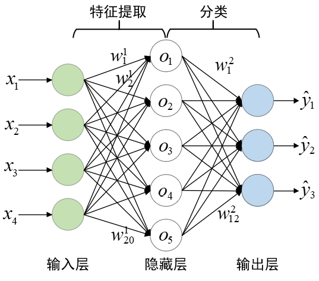
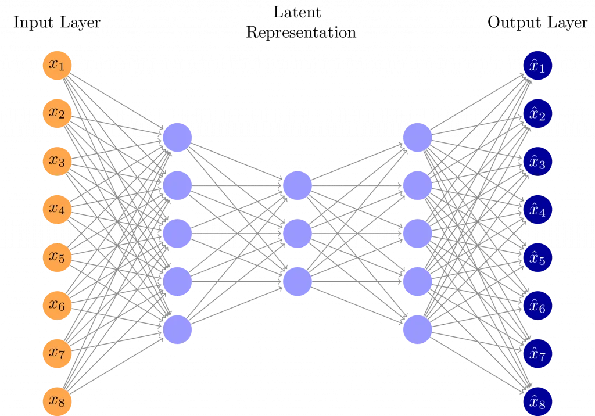
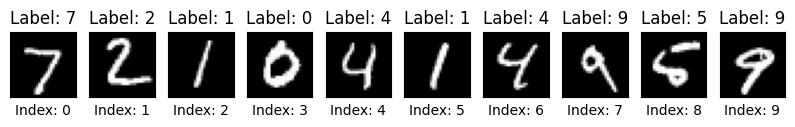
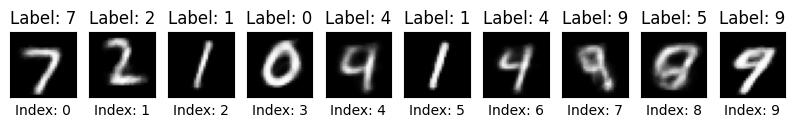
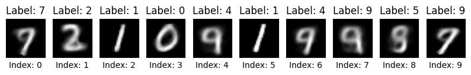
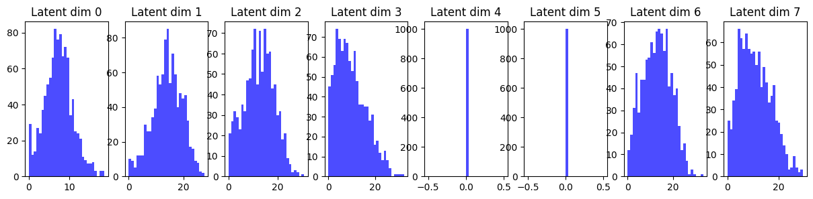
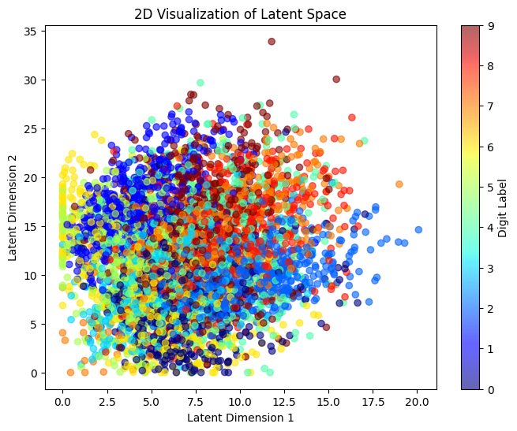
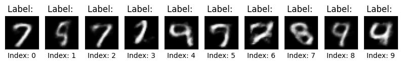
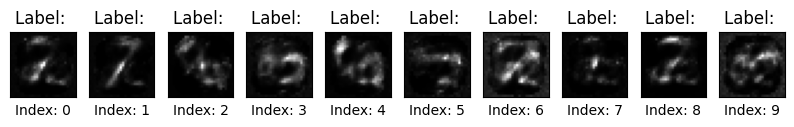

## 从函数拟合的角度看机器学习

在之前的活动中，我们介绍了神经网络的具体结构，这次我们从更抽象（潦草）的角度看待机器学习的任务。

在数学上，机器学习的核心任务可以被理解为寻找一个函数来拟合数据：

$y = f(x; \theta)$  

其中：

- $x$ 是输入数据，
- $y$  是期望的输出，
- $\theta$  是模型的参数，
- $f$  是一个高维的、可能极其复杂的函数。

这个函数可以是：

- 线性函数（线性回归）
- 多项式函数（非线性回归）
- **神经网络（深度学习）** 
- 高斯过程（贝叶斯方法）
- 核方法（SVM）

我们的目标是找到一个最优的 $f$ 使得它在训练数据和测试数据上都能很好地拟合（泛化能力强）。

## 为什么我们选择深度学习？

*下面的内容大量参考了苏剑林老师的博客*  [科学空间|Scientific Spaces](https://spaces.ac.cn/) 中的内容

所有机器学习模型之中，也许最有趣、最深刻的便是神经网络模型了。

不过其实深度学习的可解释性是很差的，你很难从神经网络的参数中看出来，它到底在做什么事情。而很多其他的方法好像都经过了精心设计，让人安心。那深度学习这个令人不安的模型，有什么优势呢？

或许在于它尝试解决了下面的问题：

**这个函数应该是什么？** 

你可能要问了，这个问题不是很基础吗，难不成只有深度学习才能回答？

事实上，在深度学习出现以前，模型和特征的选取，基本都是人工选择的。传统的模型，如线性回归、逻辑回归，基本都是我们人工指定这个函数的形式，可是非线性函数那么多，简单地给定几个现成的函数，拟合效果往往有限，而且拟合效果很大程度上取决于找到了良好的特征。

举个例子来说，一个函数如果是 $y=x^2+x$ ，是二次的非线性函数，那么如果用线性回归来拟合它，那么效果怎么也不会好的，可是，我定义一个新的特征 $t=x^2$，那么 $y=t+x$ 是关于 $t,x$ 的线性函数，这时候用线性模型就可以解决它，问题是在不知道 $y$ 的具体形式下，怎么找到特征 $t=x^2$ 呢？这基本靠经验和运气了。

而深度学习的算法是用来发现良好的特征的，这部分工作，以前通常都只是靠人工来选取，而且选取的效果不一定“良好”。现在，机器能够自动（无监督地）完成这个事情，实现的效果还不比人工选取的差，甚至线性模型都可以有不错的表现。

更进一步的技术细节就不在这里讨论了，如果你想去了解为什么神经网络可以提取特征，可以看这个视频： [【官方双语】深度学习之神经网络的结构 Part 1 ver 2.0_哔哩哔哩_bilibili](https://www.bilibili.com/video/BV1bx411M7Zx/?spm_id_from=333.1387.homepage.video_card.click&vd_source=ab342d2c83d279c56c86e2996877d2f1)  如果你想了解我们是怎么让神经网络去“学习” 的，可以看我们  [BP 教学例会的总结](./bp.md) 用 numpy 实现的手写数字识别的分类模型。当然，网络上关于神经网络的讲解太多太多了，相信你学习这方面的内容并不困难。

## 分类模型到生成模型

 

提取特征然后进行分类听起来并不是个很困难的事情，一个更有趣的挑战是，怎么让模型生成新的数据？

比如说我有很多手写数字的图片，怎么让模型学会这一系列数字的写法，生成更多张手写数字呢？

（这里我们降低点要求，不要求模型可以生成指定数字的图片，只要生成 0-9 任意数字的图片即可）

一个很自然的想法是，既然我可以训练一个神经网络提取到数据的特征，那么我们是不是可以再训练一个神经网络，将特征还原为数据呢？就像这样：



 

我们把左半边的网络叫做编码器，它的任务是提取高维数据（图片）中的特征，输出低维的隐变量 $z$ ；右半边的网络叫做解码器，它的任务是根据隐变量 $z$ 把数据重构出来。

> 我并不确定这个隐变量 $z$ 是不是真的可以代表特征，但是可以把它当作提取到的特征来理解。


训练的时候我们希望对于每张图片，重构出来的数据和原来的数据要尽量相等。那么训练好了之后，我们在低维的隐空间随便采样一个 $z$ , 是不是就可以通过解码器生成数据了呢？

实践出真知，我们来训练一个模型试试看吧！

> *这里省略了数据集的加载和超参数的设置，完整代码可以在社团仓库下载。*
>
> *不想看代码可以 [直接看结果](#训练完成看看效果)，你只需要知道编码器把 784 维的图片（28x28 像素）编码到仅仅 8 维的隐变量 z ，解码器用 z 把整张图片还原。* 

模型定义：

```python
class AutoEncoder(nn.Module):
    def __init__(self):
        super().__init__()
        
        # 设置隐藏层神经元的数量（即潜在表示的维度）
        self.num_hidden = 8
        
        # 定义自编码器的编码器部分
        self.encoder = nn.Sequential(
            nn.Linear(784, 256),  # 输入维度 784（28x28 像素），映射到 256 维
            nn.ReLU(),  # 采用 ReLU 激活函数，引入非线性
            nn.Linear(256, self.num_hidden),  # 进一步压缩到 num_hidden 维
            nn.ReLU(),  # 再次使用 ReLU 激活函数，增强特征表达能力
        )
        
        # 定义自编码器的解码器部分
        self.decoder = nn.Sequential(
            nn.Linear(self.num_hidden, 256),  # 从 num_hidden 维度恢复到 256 维
            nn.ReLU(),  # 采用 ReLU 激活函数，引入非线性
            nn.Linear(256, 784),  # 从 256 维恢复到 784 维，与原始输入大小一致
            nn.Sigmoid(),  # 使用 Sigmoid 将输出值压缩到 (0,1) 范围，适用于归一化后的像素数据
        )

    def forward(self, x):
        """
        前向传播过程：
        1. 输入数据经过编码器,得到潜在空间表示(encoded)
        2. 潜在表示再通过解码器，恢复为原始输入的近似值(decoded)。
        """
        encoded = self.encoder(x)  # 通过编码器得到潜在表示
        decoded = self.decoder(encoded)  # 通过解码器恢复原始数据
        return encoded, decoded  # 返回潜在表示和重建的输出
```

模型训练：

```python
num_epochs = 10
for epoch in range(num_epochs):
    total_loss = 0.0  # 记录当前 epoch 的总损失
    for batch_idx, data in enumerate(train_loader):
        # 获取一个批次的训练数据，并将其移动到指定设备（CPU/GPU）
        data = data.to(device)

        # 前向传播：通过编码器和解码器获取输出
        encoded, decoded = model(data)

        # 计算损失（重构误差），然后进行反向传播
        loss = criterion(decoded, data)  # 目标是使 decoded 尽可能接近原始输入 data
        optimizer.zero_grad()  # 清空梯度，防止梯度累积
        loss.backward()  # 计算梯度
        optimizer.step()  # 更新模型参数

        # 累积损失
        total_loss += loss.item() * data.size(0)

    # 计算并打印当前 epoch 的平均损失
    epoch_loss = total_loss / len(train_loader.dataset)
    print(
        "Epoch {}/{}: loss={:.4f}".format(epoch + 1, num_epochs, epoch_loss)
    )

```

## 训练完成看看效果

先来看看 loss

```bash
Epoch 1/10: loss=0.0514
Epoch 2/10: loss=0.0380
Epoch 3/10: loss=0.0322
Epoch 4/10: loss=0.0304
Epoch 5/10: loss=0.0293
Epoch 6/10: loss=0.0286
Epoch 7/10: loss=0.0281
Epoch 8/10: loss=0.0277
Epoch 9/10: loss=0.0273
Epoch 10/10: loss=0.0270
```

看起来很正常

然后抽取测试集的前 10 张图片进行测试

原图：

  

重构后图像：

   

对于一个简单的网络来说，这个效果已经可以令人满意了。

可以看到图片变模糊了，这可以理解，毕竟我们是通过仅仅 8 个维度的隐变量 $z$  还原了这些图片。一般来说增加隐藏单元的数量将提高图像质量，而减少隐藏单元的数量会使模糊变得更糟。

talk is cheap, 我们来看看 4 个维度的效果：

这是 loss：

```bash
Epoch 1/10: loss=0.0612
Epoch 2/10: loss=0.0509
Epoch 3/10: loss=0.0481
Epoch 4/10: loss=0.0467
Epoch 5/10: loss=0.0459
Epoch 6/10: loss=0.0452
Epoch 7/10: loss=0.0447
Epoch 8/10: loss=0.0442
Epoch 9/10: loss=0.0438
Epoch 10/10: loss=0.0435
```

这是重构的图像：似乎这个模型很喜欢 9

  

可以看到重构的质量明显变差了。

当然，隐空间的维度也不能太大，假设隐空间的维度和图片相同，那么编码器和解码器的最优解就是沆瀣一气，将模型退化为恒等映射。这样的话何谈生成模型呢？

## 是否可以生成新的图片

我们的模型可以重构图片，但是是否可以真的去生成图片呢？

回过头来看一下我们的模型做了什么：

这些手写数字的数据存在于高维空间（784 维），我们用编码器提取特征将其变为了 8 维空间的隐变量 $z$ , 然后解码器可以通过隐变量还原图片。

因此我们通过训练集和编码器计算出来的 $z$ , 是低维空间的一系列的点。如果我们想要通过采样得到的 $z$  生成随机的新图片，就必须去研究 $z$ 背后是什么样的一个分布。

下面是采样 1000 个训练集图片，通过编码器计算出来的 $z$ 的分布。



emmm, 似乎有两个维度在摸鱼，这是常见的维度塌陷问题。

再来看看前两个维度的分布，不同颜色代表不同的数字

 

不得不说有些混乱

根据这些图像，我们在将 4,5 维度置为 0，其他维度以 $N(9,4)$ 采样，得到了下面的结果：

> 肉眼观察分布再进行采样确实是一个奇怪的操作，但是这里我们没有更好的办法。

 

有些样本还算正常，但是其他的基本看不出来是什么。

并且随着维度的升高，采样会变得越来越困难，非常容易得到下面的结果：

 

数字已经无法辨认，而且你必须进行更长时间的采样才能获得视觉上有意义的东西。

所以很遗憾，我们这个简单的模型生成新图片的能力很差。

## 总结

为什么我们这个简单的编解码器在重构的时候还算令人满意，但是生成新图像的能力很差呢？

以及有没有更好的方法生成图片？

这些问题在下周的 VAE workshop 将得到解答。

