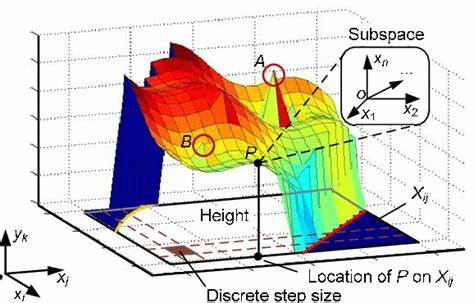

## 🌟 MLP & BP 详解：从原理到实现，手把手带你入门神经网络！🚀

在上个学期的教学例会上，我们详细讲解了 **MLP（多层感知机）** 的结构，并深入实现了 **BP（反向传播）** 算法，还用 **手写数字识别** 作为实际案例。本篇推文将完整梳理 MLP 的核心知识，带你从数学推导到直观理解，一步步掌握深度学习的基石！💡

------

## **什么是 MLP？** 

MLP（Multi-Layer Perceptron，多层感知机）是最基本的神经网络架构之一，由多个 **全连接层（Fully Connected Layer）** 组成，是 **前馈神经网络（Feedforward Neural Network）** 的代表。

MLP 通过 **多个隐藏层** 及 **非线性激活函数** 使网络具备更强的特征学习能力。其典型结构如下：

🔹 **输入层**：接受数据（如手写数字的像素值）
 🔹 **隐藏层**：负责特征提取和模式识别（可多层）
 🔹 **输出层**：生成最终预测结果（如 0~9 的分类）

MLP 的本质是一个 **多维非线性映射**，用数学公式表示就是：

$y = \sigma(W_2  \sigma(W_1  x + b_1) + b_2)$   

或者这样写更清晰一些：

$ y_1 = \sigma(W_1x+b_1)$

$y_2 = \sigma(W_2 y_1+b_2)$  

其中：

- $x$  是输入数据
- $W_1, W_2$  是权重矩阵
- $b_1, b_2 $ 是偏置
- $\sigma(\cdot) $ 是激活函数   

你可能有很多的疑问，不是说这是一个 “网络” 吗，怎么看过去全是矩阵啊向量啊，还有这个激活函数又是什么东西。

如果你参加了我们的例会，那么热情的助教哥哥将会为你细心地解答。如果你错过了我们的活动，为你推荐 3B1B 的视频，他对 mlp 的结构有非常深刻的讲解。

视频连接： [【官方双语】深度学习之神经网络的结构 Part 1 ver 2.0_哔哩哔哩_bilibili](https://www.bilibili.com/video/BV1bx411M7Zx/?spm_id_from=333.1387.homepage.video_card.click&vd_source=ab342d2c83d279c56c86e2996877d2f1) 

 

为了进行接下来的阅读，希望你能理解/接受以下的事实：

- 矩阵的每一个参数，都对应网络中的一条线
- 我们期望，如果找到了适合的参数，神经网络可以进行特征提取和分类
- 矩阵中的参数都是平等的，我们很多时候可以把矩阵里的所有参数当成一个参数看待

## 任务：手写数字识别

在第一次教学例会上，我们直接把训练好的参数给了同学们。同学们实现了模型的框架，加载了提供的参数，很好地让神经网络完成了任务。要完成这个框架进行推理，你还需要学会下面的内容：

为了和代码保持符号一致性，让公式更加清晰，我们规范一下符号。通常情况下，我们更习惯把向量写成行向量，并且右乘权重矩阵。

- **输入层**:  X（输入数据）
- **隐藏层**:
  - **加权和**（未激活值，logits）：$Z_1 = XW_1 + b_1 $ 
  - **激活输出**（隐藏层输出）：$A_1 = \sigma(Z_1) $ 
- **输出层**:
  - **加权和（logits）**：$ Z_2= A_1W_2 + b_2 $ 
  - **Softmax 概率输出**：$ \hat{y} = A_2 =  \text{Softmax}(Z_2) $ 

在手写数字识别任务中，我们的 MLP 最后一个 **输出层使用 Softmax 函数** 来将神经网络的输出转化为概率分布, 最终计算出来 $\hat y$ 是一个向量,其每一个分量为：
$$
\hat{y}_i = \frac{e^{z_i}}{\sum_{j = 1}^{10} e^{z_j}}
$$
关于 Softmax 的相关知识这里不做展开，可以验证这确实是一个概率分布。其中 10 表示输入会被分类为 0 - 9 一共 10 个数字。

### **损失函数（Loss Function）** 

神经网络的目标是从数据中**学习模式**，但初始的模型参数（权重和偏置）是随机的，因此它的预测结果通常很差。为了衡量模型的预测有多好或多差，我们需要一个**客观标准** —— **损失函数**。我们可以把 **损失（Loss）** 看作是 **神经网络的指南针**，指引模型不断优化，使其学习到更好的特征表示。 

简单的说，Loss 越小，模型（至少在训练集上）的预测效果应该就越好。

在手写数字识别任务中，我们使用**交叉熵损失函数** 来计算 Loss
$$
L = -\sum_{i=1}^{10} y_i \log(\hat{y}_i)
$$
其中：

- $y_i $是 **真实标签的 one-hot 编码**（例如 3 的 one-hot 编码为 [0,0,0,1,0,0,0,0,0,0]
- $\hat{y}_i $ 是 **模型预测的类别概率** 

如果真实类别是 $c $ ，则损失函数可以简化为：
$$
L = -\log(\hat{y}_c)
$$

即，我们只关心真实类别  c 处的预测概率，并希望它尽可能接近 1。

如果你好奇交叉熵为什么叫这个名字（和熵有啥关系），以及为什么使用交叉熵作为损失函数，可以自己去网上找找资料哦。

### 数据集下载

我们在教学中使用 **MNIST 数据集**，它包含 **28×28 的手写数字灰度图像**。输入数据被展平成 **784 维向量** 传入 MLP，经过 **隐藏层特征提取**，最终输出 **10 维概率向量**，对应 **0-9** 的预测类别。

数据集下载：

### 代码实现

其实核心代码只有这么几行：

```python
def forward(self, X: np.ndarray):
    # 前向传播
    self.Z1 = np.dot(X, self.W1) + self.b1
    self.A1 = self.sigmoid(self.Z1)
    self.Z2 = np.dot(self.A1, self.W2) + self.b2
    self.A2 = self.softmax(self.Z2)
    return self.A2
```

到这里，相信你已经可以写出一个 mlp 了。不过数据集的下载和加载，以及 numpy  的语法可能让人有点头疼，大家可以参考我们社团仓库的代码。

代码链接：


但是我想大家肯定不满足于加载模型，希望自己训练出一个模型。因此就有了第二次教学例会，为大家讲解 BP 反向传播算法。

------

## 🔹 **数学基础** 

MLP 通过 **梯度下降（Gradient Descent）** + **反向传播（Backpropagation, BP）** 来更新参数，使其更接近正确的目标值。

相信大家对于矩阵乘法都是没有什么疑惑的，但是在这次教学例会开展的时候，大多数同学还没有学过多元函数的求导，并不知道什么是梯度，或者对于梯度一知半解。我们不希望像很多教程一样对进行求导不加解释：这么求个导得到的就是让函数值上升最快的“方向” 总之就是梯度嘛；或者对链式法则随意运用：偷偷进行了一个列项相消，反正这么算是对的。

因此在例会上，我们选择回避“复杂”的公式，直接通过分析误差一步步得到更新参数的方法，并且直接把这些推导翻译成代码。

### 多元函数求导

首先回顾一下一元函数的导数：$y=f(x),\frac{\mathrm{d} y}{\mathrm{d} x} = f'(x)$ 

大家在高中都学过，这是函数图像上切线的斜率。但是希望大家不要忘记，这其实是在研究 x 的变化会如何影响 y 的值,
即当 x 变化了 $\Delta x $，y 的变化 $\Delta y = f_x \Delta x$ 。（为了和多元函数的导数对应，把 $ f'$ 写成 $f_x$  ）

而对于多元函数，我们认为当自变量的变化足够小的时候，它们对函数值的影响是独立的（微积分课本上有严格的证明），可以直接加起来。即
$$
u = f(x, y, z) ,\Delta u = f_x\Delta x+f_y\Delta y +f_z \Delta z
$$
其中 $f_x$ 表示将 其余变量视为常数，u 关于 x 的导数。

那么怎么处理复合函数呢，好多括号一层一层的，这该怎么求导？

很简单，把括号拆开就行了。

举个例子：
$$
w = f(u, v) , u = g(x, y), v = h(y, z)
$$
 那么 
$$
\begin{align}
\Delta w &= f_u \Delta u + f_v \Delta v \\
&= f_u(g_x \Delta x+g_y \Delta y) + f_v(h_y \Delta y+h_z \Delta z)\\
&= f_ug_x \Delta x+ (f_ug_y+f_vh_y)\Delta y+ f_vh_z\Delta z
\end{align}
$$
这其实就是所谓的链式法则啦，希望你看到这里，能有一点误差在 "反向传播的感觉"。

### 梯度

不管怎么样，我们可以计算出所有的自变量的变化会如何影响函数值。

$ \Delta w = w_{x1} \Delta {x_1} + w_{x2} \Delta x_2 + w_{x_3} \Delta x_3 \cdots$  , 其中 $w_x$  表示 w 对 x 的导数

我们具体该如何调整自变量从而让函数值变大呢？

这其实非常简单，对于每一个变量 x ，如果 $w_x>0$ 的，那么我们就让 $\Delta x >0$ ，即让 x 增加。如果 $w_x <0$, 我们就让 x 减小。

像这样调整所有变量，就可以让函数值变大了，就这么简单。

一般来说讲梯度的时候会画这样一张图：（然后直接给出公式定义不加解释地从二维拓展到高维

  


这幅图说明，有一个最佳的“方向”，可以让函数值变化的最快，我们应该如何找到这个方向呢？

> 数学的力量在于其普适性和抽象性，而非仅仅依赖低维空间的可视化，不要过于依赖于直观的形象化理解。

注意到我们可以把 $\Delta w$ 写成向量内积的形式：$\Delta w = \vec \nabla w \cdot \overrightarrow  {\Delta x}  $  

其中 $\overrightarrow  {\Delta x}  $ 表示向量 $(\Delta x_1 ,\Delta x_2,\Delta x_3,\cdots )$ 

而 $\vec \nabla w =   (w_{x1} , w_{x2} , w_{x_3} ,\cdots)$ 就是所谓的”梯度“

那么显然，当 $ \overrightarrow  {\Delta x} $ 的长度一定时，如果它的方向和梯度相同，$\Delta w$ 最大即 w 增长最多。

所以我们说，梯度方向是函数值增长最快的方向。相应的，梯度的反方向，是函数值下降最快的方向。

## 🚀BP（反向传播）

### 先看代码

如果要严格推导 BP 的公式，不可避免地需要计算对矩阵的求导，很是麻烦，所以我们直接来看代码吧！

你会发现，我们好像把矩阵当成一个普通的变量来处理了，这里就不多做解释啦,可以自己想想为什么会这样。

> 事实上，矩阵和标量的微分规则是一致的，这是因为 矩阵微分的运算规则可以用向量化形式表达，并且 Numpy 的广播机制 使得代码实现更加简洁。

```python
def backward(self, X, y):
    # 反向传播
    m = X.shape[0] # batch size，即输入数据的样本数量
    y_onehot = np.zeros_like(self.A2)
    y_onehot[range(m), y] = 1

    dZ2= self.A2 - y_onehot
    dW2 = np.dot(self.A1.T, dZ2) / m
    db2 = np.sum(dZ2, axis=0, keepdims=True) / m

    dA1 = np.dot(dZ2, self.W2.T)
    dZ1 = dA1 * self.sigmoid_derivative(self.Z1)
    dW1 = np.dot(X.T, dZ1) / m
    db1 = np.sum(dZ1, axis=0, keepdims=True) / m

    # 更新权重和偏置
    self.W1 -= self.learning_rate * dW1
    self.b1 -= self.learning_rate * db1
    self.W2 -= self.learning_rate * dW2
    self.b2 -= self.learning_rate * db2
```

注意代码里的 `dZ2,dW2` 计算的是梯度，也就是 $\Delta z_2,\Delta W_2$ 前面的系数。

### 逐步讲解

可能你还是有点晕，让我们一行一行看下去：

 `m= X.shape[0]` 是 batch size，即输入数据的样本数量。

`y_onehot`  是真实标签的 one-hot 编码（例如 3 的 one-hot 编码为 [0,0,0,1,0,0,0,0,0,0]

---

#### 梯度的计算

`dZ2= self.A2 - y_onehot`  这是在计算关于$Z_2$ 的梯度，推导如下：

**公式预警，可以跳过**   

每一个样本的误差 $L = -\sum_{i=1}^{10} y_i \log(\hat{y}_i)$ 提示：之前定义了$ \hat{y} = A_2$ 

公式中的 y 对应代码中的 `y_onehot ` ，如果这个样本的类型是 i，那么 $y_i = 1$  ，否则$y_i = 0$ 

$\hat {y} $ 对应代码中的 `A2` , 

现在假设这个样本的类型为 k

求导得到： $\Delta L = -\frac{1}{ A_{2,k}}\Delta A_{2,k}$   ,$A_{2,k}$ 表示 $A_2$ 的第 k 的元素
$$
\begin{align}
A_{2,k} &= \frac{e^{z_k}}{\sum_{j = 1}^{10} e^{z_j}} ，
记 M = \sum_{j = 1}^{10} e^{z_j}\\
则A_{2,k}&= \frac{e^{z_k}}{M}\\
\Delta A_{2,k} &= \frac{e^{z_k}(M - e^{z_k}) }{M^2}\Delta z_k+
\sum_{j\not = k} -\frac{e^{z_j}}{M^2}\Delta z_j\\
&= A_{2,k}(1-A_{2,k})\Delta z_k - \sum_{j\not = k}A_{2,k}A_{2,j}\Delta z_j\\
&= A_{2,k} \left ( \Delta z_k - \sum_{j=1}^{10}A_{2,j}\Delta z_j \right )
\end{align}
$$
将$\Delta A_{2,k}$带入 $\Delta L $ 中，得到： 
$$
\Delta L =  \sum_{j=1}^{10}A_{2,j}\Delta z_j - \Delta z_k 
$$
观察可以发现 $\Delta z_j $  前面的系数为 $A_{2,j} - y_j$ 

提示：$y_k = 1, y_j = 0 ,j \not = k$ 

终于，我们得到了$ L$ 关于 $Z_2$ 的梯度为 $A_2 - y$ ，挺神奇的，对吧？

所以$\Delta L = (A_2-y) \Delta Z_2^T = (A_2-y) \cdot\Delta Z_2$   

代码中体现为：`dZ2= self.A2 - y_onehot` 

> 一句话总结一下：交叉熵的导数结果就是 **预测值 - 真实值**，这也是为什么在代码中：
>
> dZ2= self.A2 - y_onehot

---

```python
dW2 = np.dot(self.A1.T, dZ2) / m
db2 = np.sum(dZ2, axis=0, keepdims=True) / m
dA1 = np.dot(dZ2, self.W2.T)
```

现在计算出了$L$ 关于$Z_2$ 的梯度 dZ2 (这是梯度的意思，不是微分，希望没有对你造成困扰)

那么就有 $\Delta L = \text{dZ2} \cdot\Delta Z_2$  

我们又知道:  $Z_2= A_1W_2 + b_2$ ,所以有：

$\Delta Z_2 = A_1 \Delta W_2+ \Delta A_1 W_2 +\Delta b_2$   

带入得到：
$$
\Delta L = \text{dZ2}\cdot(A_1 \Delta W_2) + \text{(dZ2)} W_2^T \Delta A_1 + \text{(dZ2)} \Delta b_1\\
$$
因此有 

- $\text{dW2} = \text{dZ2} A_1^T$ 
- $\text{dA1} = \text{dZ2} W_2^T$ 
- $\text{b1} = \text{dZ2}$ 

对应到代码中就是：

```python
dW2 = np.dot(self.A1.T, dZ2) / m
dA1 = np.dot(dZ2, self.W2.T)
db2 = np.sum(dZ2, axis=0, keepdims=True) / m
```

> 除以 `m`，是为了确保梯度的更新不会因 batch size 大小不同而变化过大，从而提高训练的稳定性

其余梯度的计算和上面类似，相信你可以独立完成它们的计算。

#### 更新参数

梯度计算完毕后，我们使用可以更新参数让Loss变小 （梯度下降法）

$W_1 = W_1 - \alpha dW_1$

$b_1 = b_1 - \alpha db_1$

$W_2 = W_2 - \alpha dW_2$

$b_2 = b_2 - \alpha db_2$ 


其中$ \alpha$ 是学习率。

对应的代码为：

```python
# 更新权重和偏置
self.W1 -= self.learning_rate * dW1
self.b1 -= self.learning_rate * db1
self.W2 -= self.learning_rate * dW2
self.b2 -= self.learning_rate * db2
```

## 进行训练

```python
def train(self, X, y, epochs, batch_size):
    for epoch in range(epochs):
        for i in range(0, X.shape[0], batch_size):
            X_batch = X[i:i+batch_size]
            y_batch = y[i:i+batch_size]

            # 前向传播
            self.forward(X_batch)

            # 计算损失
            loss = self.compute_loss(y_batch)

            # 反向传播
            self.backward(X_batch, y_batch)

        print(f"Epoch {epoch+1}/{epochs}, Loss: {loss:.4f}")
```

------

## 结束

🏆 **完整代码已经实现**，你可以直接运行它，并调整网络参数观察训练效果！

参考代码：

------

## 🎯 **总结**

✅ MLP 是最基础的神经网络结构，构成了更复杂模型（如 CNN、Transformer）的基础
 ✅ 反向传播（BP）通过链式求导计算梯度并更新参数
 ✅ 选择合适的激活函数能提升网络学习能力
 ✅ MLP 能够用于 **手写数字识别、语音识别、金融预测** 等广泛场景

💬 **你是否已经掌握 MLP 的核心知识？欢迎在评论区讨论你的理解！** 🔥

🚀 **下一步建议** 📌 尝试自己实现一个 **不同隐藏层数/神经元数** 的 MLP
 📌 试试 **不同的激活函数/优化器** 观察效果
 📌 深入研究 **卷积神经网络（CNN）**，它对图像识别更强大！

------

🎉 **如果这篇推文对你有帮助，欢迎点赞 & 转发！**
 💡 **关注我们，解锁更多深度学习干货！** 🔥