## 教程概述

这个教程将带领大家一步步完成基本编程配置，这样在后续例会中就能更高效地学习人工智能相关的内容啦！

配置环境是一件既重要又有些麻烦的事情。大家在过程中可能会遇到各种各样之前从未碰到过的问题，这是很正常的，所以一定要保持耐心。遇到问题时，首先要自己思考，尝试利用 AI 工具寻找解决方法；如果还是解决不了，可以在 AIA 学社群聊 中提问，我们也鼓励大家积极互相帮助。请记住，思考和提问本身就是学习的一部分。实在无法解决的情况下，再参考本篇教程的指导。

需要说明的是：本教程在前半部分会写得比较详细，帮助大家快速上手；到了后面，说明会逐渐简略，希望大家在这个过程中慢慢培养出独立配置环境的能力。这样，今后无论遇到什么新环境，都能自己解决并适应。

## 一、VSCode 安装和 Python 环境配置

### 1. 为什么使用 VSCode？

学习编程，其实就是在学习和计算机“对话”。我们把想法和步骤写成一行行代码，计算机就会严格按照这些指令去执行。写程序的过程，不只是把字打进去，还包括组织结构、检查语法、运行调试、修改完善。随着代码越来越多，我们就需要一个合适的工具，来帮我们把这些事情做得更顺畅。

这就是 **代码编辑器** 存在的意义。它不仅仅是“写字的地方”，而是一个专门为写程序准备的工作台。

在众多工具里，**Visual Studio Code**（简称 **VS Code**） 是最受欢迎的选择之一。它的优势在于：

- 轻巧高效：打开快，占用资源少，几乎任何电脑都能流畅使用。

- 功能强大：内置终端可以直接运行程序，还支持调试功能，方便一步步排查错误。

- 适应多种语言和场景：不论是 Python、C++ 还是 Jupyter Notebook，VS Code 都能通过插件轻松支持。

- 扩展性和协作性：插件商店极其丰富，可以根据个人需求添加功能；同时自带 Git 支持，方便和团队协作、和 GitHub 项目结合。

对于我们社团来说，VS Code 是最合适的选择。它既能满足大家写 Python 脚本、运行 Jupyter Notebook 的需求，又能支持后面学习 Pytorch、管理 GitHub 项目。更重要的是，它学习成本低，上手快，让新手可以很快进入编程的状态。

### 2. 如何安装 VSCode？

#### **2.1 安装 VSCode**

浏览器中打开 [VSCode 官网](https://code.visualstudio.com/)，点击下载安装包：

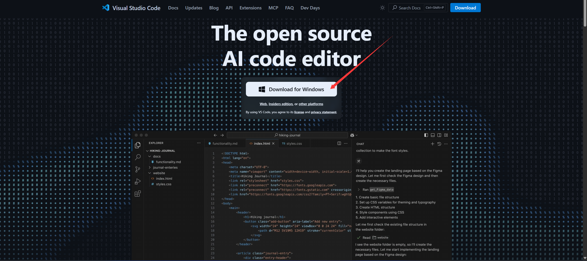

在下载中找到安装包，双击运行：

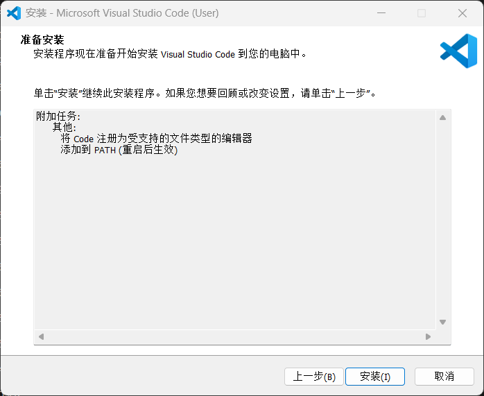

VSCode 的安装位置可以自己指定，其它一路默认即可，然后点击安装：


之后就能打开啦！

#### **2.2 把语言设置为中文（可选）**

VSCode 强大的功能来源于它能够安装的各种 **扩展**（Extensions）。在左侧找到扩展对应的图标，由四个小方块堆积而成：

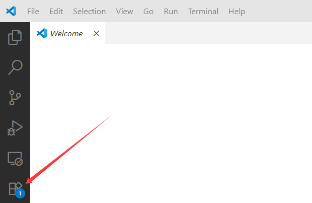

搜索 `Chinese`，找到简体中文扩展，点击 `install` 安装：

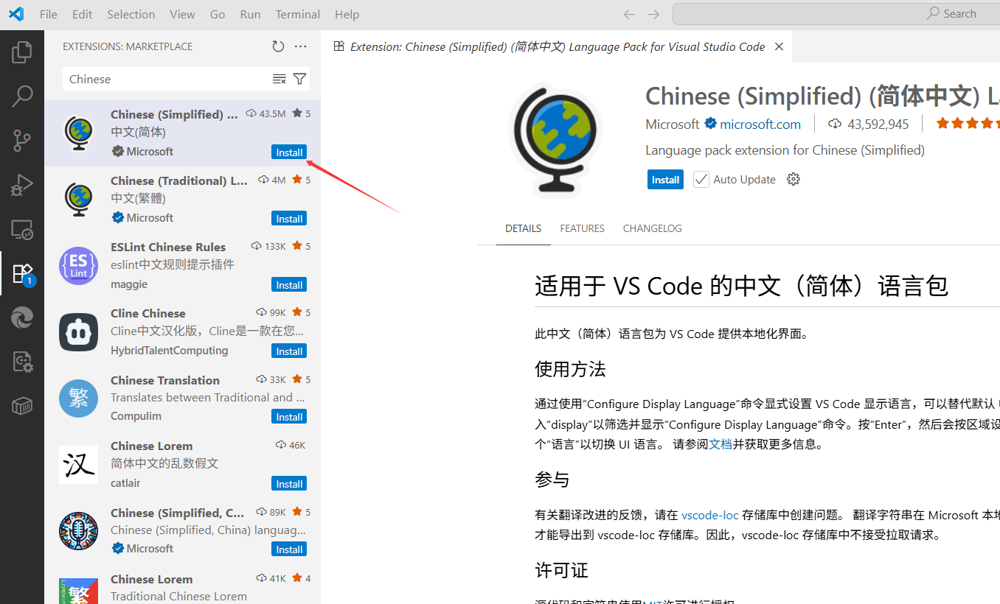

安装后，右下角会蹦出来一个弹窗，提示是否要更换语言并重启 VSCode，点击即可：

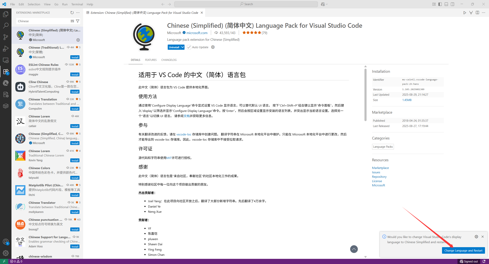

此后如果想要切换语言，只需 `ctrl` + `shift` + `P` 唤出命令界面，搜索 `language`，找到 `Configure Display Language` 即可。

### **3. 安装 Python**

在 [Python 官网](https://www.python.org/) 的导航栏点击 Downloads，之后下载最新版本的 Python 解释器：

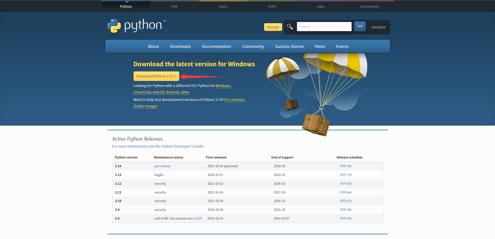

在下载中找到安装包，运行它来安装 Python，一路默认即可：

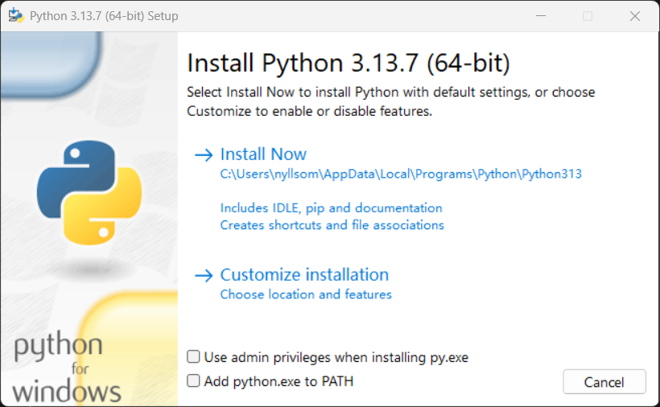

安装好 Python 之后，在 VSCode 页面左侧找到扩展对应的图标，由四个小方块堆积而成，进入扩展商城之后搜索 `python`，找到 Python 扩展并安装：

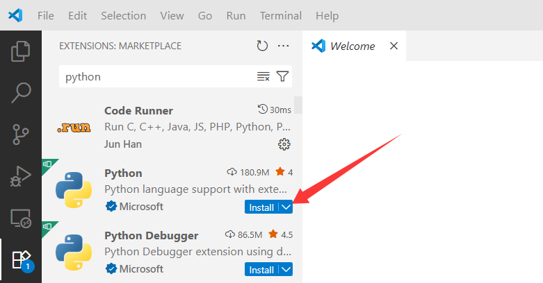

### 4. 使用 VSCode 编写第一个 Python 程序


#### **4.1 VSCode 的基本工作原理**


- **以文件夹作为工作区的基本单位**

   在 VSCode 中，工作区就是一个文件夹。你可以把它理解为“一个项目的家”。在这个文件夹里，你可以自由创建、修改、删除文件和子文件夹。VSCode 会把它们集中展示在左侧的资源管理器中，方便统一管理和编辑。

- **为什么要以文件夹作为工作区**

   这样做的好处是：
   - 把相关的文件都放在同一个地方，结构清晰，不容易混乱。
   - VSCode 可以根据这个文件夹自动识别和保存一些配置信息，比如你用到的 Python 环境、插件设置等。下次打开时，VSCode 会直接记住这个文件夹的工作状态。
   - 对于代码开发来说，文件之间往往是互相联系的，以文件夹为单位正好能把它们组织在一起。

- **使用 VSCode 的正确方式**

   在使用 VSCode 时，建议每次做新任务（比如一个小实验或者一个新项目）都新建一个文件夹，把相关代码和文件放进去，再用 VSCode 打开这个文件夹作为工作区。这样能避免文件散乱在各个角落，方便以后查找和管理，也能让 VSCode 更好地帮你管理环境和配置。

#### **4.2 编写第一个 Python 程序**

在左上角找到 `File` 或 `文件` 选项，单击之后选择 `Open Folder` 来打开一个你喜欢的文件夹（你可以先新建一个，再通过 VSCode 打开）。这里我打开的是 `Demo` 文件夹。

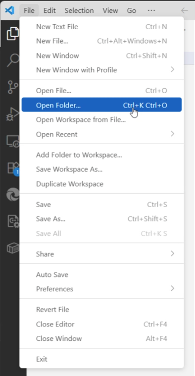

打开之后，在左上角可以看到四个图标，左起第一个和第二个分别是新建文件和新建文件夹。

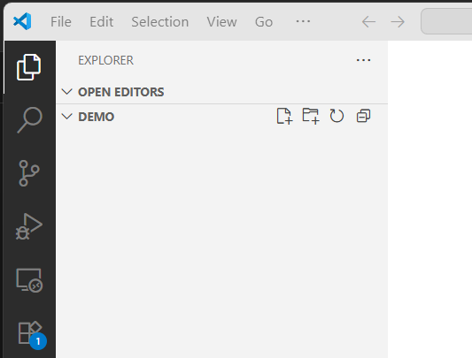

点击最左侧的图标，输入 `hello.py`，按下回车之后即生成了一个名为 `hello.py` 的 Python 文件。

在 `hello.py` 中输入以下代码：

```py
print("AI is for All")
```

之后在左上角导航栏找到 `terminal` 或 `终端` 选项，打开之后点击第一个选项以新建一个终端：

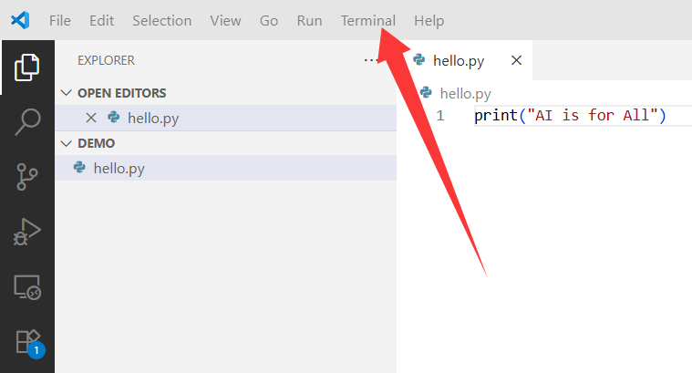

在终端输入：

```
python hello.py
```

以调用 python 解释器来运行 `hello.py`。

终端中出现 `AI is for All` 即成功运行。

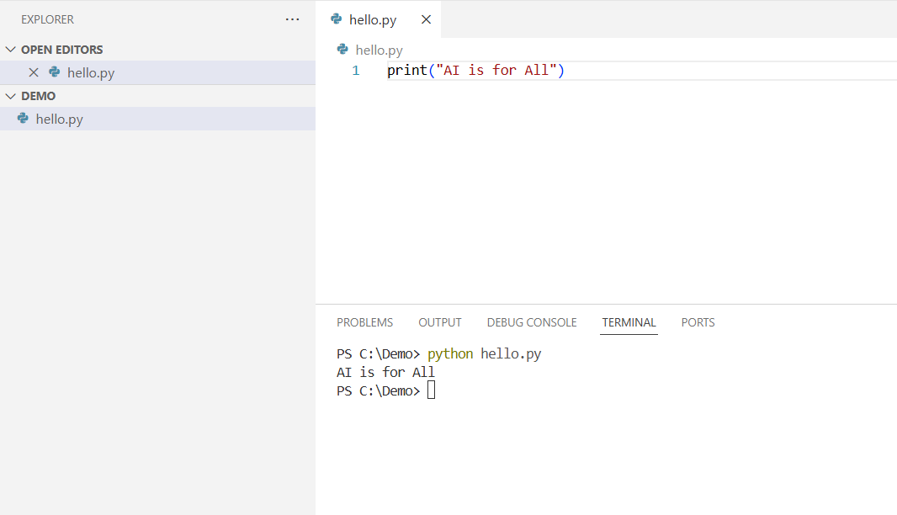

## 二、Conda 配置

在上一部分中，你已经配置好了 vscode 和 python，我们已经有了两个非常强大的工具！现在我们来安装另一个强大的工具：conda，一种环境管理器。

### 1. Conda 是干啥的

P}ython 的一大优势是拓展性极强。所谓拓展性，就是说在 python 编写人员提供的基础工具上，众多网友可以利用这些工具构建更强大的工具，然后发布到网上（一般是 github，我们将会在第四次培训的时候介绍它），供你使用。这样被重新构建的更好用的工具，一般被打包成"package"供大家一起使用，这个行为就是对“[开源](https://en.wikipedia.org/wiki/Free_software_movement)”的简单解释。譬如说，我们机器学习中常用的两个 package 就是 Pytorch 和 Tensorflow，前者是 meta 公司发起的项目，后者是 Google。

不难想象，如果我要开发 package A，很有可能我也会站在别人的肩膀上去实现我想要的功能，譬如用 package B ，而不是全部从头开始。此时别人如果要使用 package A，就一定得下载 package B，否则无法正常工作。Package A 和 package B 的关系就叫作依赖关系（dependency）。

打个比方：

- 你写了一份数据分析工具（package A），里面调用了另一个绘图库（package B）的 plot() 函数来画图。
- 你当时写代码时，B 的版本是 2.0，一切正常。
- 结果 B 更新到了 3.0，开发者觉得 plot() 过时了，就直接删掉了。

这时候，如果你电脑上只有 package B v3.0，那么 package A v1.0 就跑不起来了。更尴尬的是：你还想单独用 B v3.0 的一些新功能（比如交互式可视化），但又必须保留 B v2.0 才能让 A 正常工作。这就是一个典型的“依赖冲突”(dependency conflict)问题。

难道鱼和熊掌不可兼得吗？

可以的！Conda 就是帮你解决这种情况的神器。Conda 是一种环境管理器，它允许你为不同的项目创建不同的[环境(environment)](https://www.anaconda.com/docs/tools/working-with-conda/environments)，每个环境里都可以有自己的一套 Python 和依赖包，互不干扰。这样一来，相互冲突的环境可以在一台电脑上共存，我们只需要在使用的时候调用我们需要的环境即可。简直完美！

环境管理器和包管理器有所不同。如果只是想管理 Python 的package，进行下载、更新和删除，我们还可以使用 python 自带的 pip 工具。但是 pip 工具并没有环境的概念，不能处理依赖冲突。所以我们可以在不同的虚拟环境里使用 pip 工具，来实现 python 虚拟环境的包管理。在之后的教程里，我们将采取这种方式。


### 2. 安装 Anaconda

#### 2.1 下载安装包

Conda 提供了两种方案：

- [Anaconda](https://www.anaconda.com/download) 为你下载好了大家最常用的一些包，譬如用于绘图的 matplotlib，科学计算的 numpy 等。
- [Miniconda](https://www.anaconda.com/docs/getting-started/miniconda/main) 是 Mini 版本的 Anaconda，只会提供一部分的必要包，占用的空间较小。

点击上面两个链接中的任意一个，根据你的需求选择一个下载吧！

#### 2.2 安装ing

下载好安装包之后，双击运行。

- 如果你用的是 Windows，一路默认即可；
- 如果你用的是 Linux，在最后一步安装时，会遇到 `yes` 和 `no`。对于初学者，我们建议大家选择 `yes`；如果你刚刚坚定地选择 `no`，或者想要了解他们的区别，请跳转到 **教练，我还要学！** 的 ***如果不把 conda 配置到环境变量**。

#### 2.3 安装成功了吗？

- 如果你用的是 Windows，请在最底下的搜索栏查找 `Anaconda Prompt` 并打开。
- 如果你用的是 Linux，请打开你的 `terminal`。

输入 `conda --version`，如果你看到类似的输出：

```
conda 24.7.1
```

恭喜你，说明你安装成功了！

### 3. [Anaconda 怎么用](https://docs.conda.io/projects/conda/en/latest/user-guide/getting-started.html)

这个部分将会带着你创造一个叫 *AIA* 的环境，以便之后我们的教学例会中所使用的包不会和你未来课程中使用的包产生冲突。

#### 3.1 创造 AIA 环境

请你输入 `conda create --name AIA python=3.10`。此时你可能会遇到类似于

```
...
proceed ([y]/n)?
```

的语句，输入 `y`加回车即可。

#### 3.2 激活你的环境

正如上面所说，conda 是可以管理环境的。这就意味着你可以选择进入或退出某一个自定义的环境。譬如我们要进入*AIA*环境，你可以输入

```
conda activate AIA
```

我们将会在下一次教程中告诉你要下载哪些包，所以此时你不用太在意在这个环境中要做什么，可以输入如下指令退出

```
conda deactivate AIA
```

如果你想要新建别的名字的环境，只需要把上述流程中的 `AIA` 替换为你喜欢的名字。

### 4. 教练，我还要学！

#### 4.1 一些常见的指令

最好的学习资料就是[官方 documentation](https://docs.conda.io/projects/conda/en/4.6.0/_downloads/52a95608c49671267e40c689e0bc00ca/conda-cheatsheet.pdf)。下面我列举几个常用的指令，供大家把玩。

- 譬如说你一开始打错 AIA 名字了，你写成了 `ILoveAIA`。如果想改掉这么长的名字，但是你又不想改变你已经配好的环境。那就复制这一个环境，取名叫 `AIA`，然后删除原来的环境。

  ```
  conda create --clone ILoveAIA --name AIA
  conda remove --name ILoveAIA --all
  ```

  （请保持对 AIA 的热爱 qwq）
- 下载 名字叫做 `<PACKAGE>`的 `PACKAGE`

  `conda install <PACKAGE>`
- can can need 这个环境里有什么包

  `conda list`
- 有时候你发现自己下载包的时候下错环境了，没关系，conda 会记录你的修改，你可以通过

  `conda list --revisions`

  得知自己上一次修改被标记为多少。具体来说，你可能得到这样的输出

  `2025-06-13 21:20:58  (rev 0)`

  说明这是第 0 次修改。譬如说你现在做的是第 1 次修改.如果你想要回到第 0 次修改的状态，那就执行

  `conda install --revision 0`

#### 4.2 *如果不把 conda 配置到环境变量

首先，请自行了解什么是环境变量。简单来说，如果把 conda 配置到环境变量，那么终端可以在任何地方直接使用 conda 指令。

Windows 下安装时，如果一路默认并不会把 conda 配置到环境变量中。所以在 PowerShell 或者 cmd 终端中输入 `conda`，终端并不能成功识别；但 Windows 下我们有 Anaconda Prompt，在这个终端里我们可以自由使用 conda 指令。

Linux 下安装时：

- 如果选择 `yes`，你将把 conda 配置到你的环境变量中；这可能会方便你使用 conda，但你在每一次开启终端的时候都会有大约一秒的延迟，深度使用终端的人会明显感受到差异。
- 如果选择 `no`，由于没有将 conda 配置到环境变量中，你将无法在终端里直接使用 `conda` 指令，而是需要找到 conda 可执行文件，并在使用的时候指明完整路径。如此一来，终端才能正确执行。例如：

  - 想要查看 conda 版本，需要在 conda 的目录下找到可执行文件 `conda`：
    - 终端输入：`/路径/Anaconda3/bin/conda --version`。其中 `路径` 替换为你的 `Anaconda3` 的存储路径；如果你安装的是 Miniconda，还需要把 `Anaconda3` 替换为 `Minconda`。
  - 想要激活虚拟环境，需要在 conda 的目录下找到可执行文件 `activate`：
    - 终端输入：`/路径/Anaconda3/bin/activate 虚拟环境名`
  - 其他操作同理。