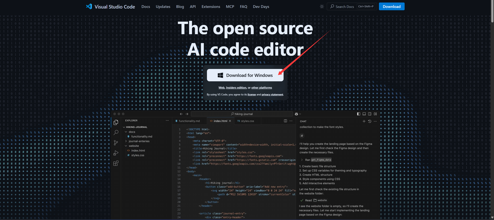
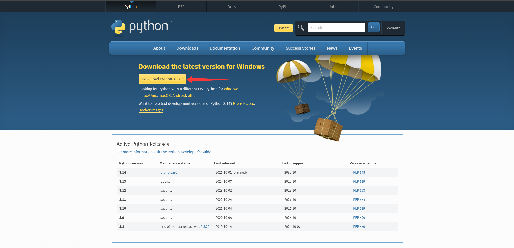
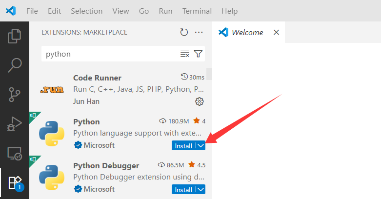
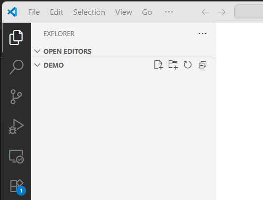
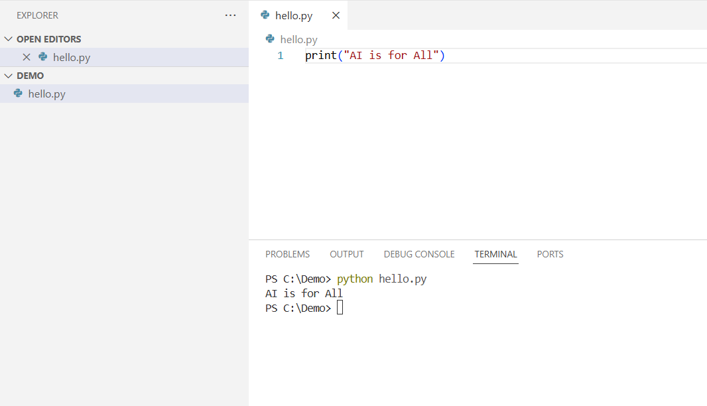

## 教程概述

这个教程将带领大家一步步完成基本编程配置，这样在后续例会中就能更高效地学习人工智能相关的内容啦！

配置环境是一件既重要又有些麻烦的事情。大家在过程中可能会遇到各种各样之前从未碰到过的问题，这是很正常的，所以一定要保持耐心。遇到问题时，首先要自己思考，尝试利用 AI 工具寻找解决方法；如果还是解决不了，可以在 AIA 学社群聊 中提问，我们也鼓励大家积极互相帮助。请记住，思考和提问本身就是学习的一部分。实在无法解决的情况下，再参考本篇教程的指导。

教程一共分为 $4$ 个部分，并将逐步同步在社团网站上，目前已经同步了前两个部分。需要说明的是：本教程在前半部分会写得比较详细，帮助大家快速上手；到了后面，说明会逐渐简略，希望大家在这个过程中慢慢培养出独立配置环境的能力。这样，今后无论遇到什么新环境，都能自己解决并适应。

## 一、VSCode 安装和 Python 环境配置

### 1. 为什么使用 VSCode？

学习编程，其实就是在学习和计算机“对话”。我们把想法和步骤写成一行行代码，计算机就会严格按照这些指令去执行。写程序的过程，不只是把字打进去，还包括组织结构、检查语法、运行调试、修改完善。随着代码越来越多，我们就需要一个合适的工具，来帮我们把这些事情做得更顺畅。

这就是 **代码编辑器** 存在的意义。它不仅仅是“写字的地方”，而是一个专门为写程序准备的工作台。

在众多工具里，**Visual Studio Code**（简称 **VS Code**） 是最受欢迎的选择之一。它的优势在于：

- 轻巧高效：打开快，占用资源少，几乎任何电脑都能流畅使用。
- 功能强大：内置终端可以直接运行程序，还支持调试功能，方便一步步排查错误。
- 适应多种语言和场景：不论是 Python、C++ 还是 Jupyter Notebook，VS Code 都能通过插件轻松支持。
- 扩展性和协作性：插件商店极其丰富，可以根据个人需求添加功能；同时自带 Git 支持，方便和团队协作、和 GitHub 项目结合。

对于我们社团来说，VS Code 是最合适的选择。它既能满足大家写 Python 脚本、运行 Jupyter Notebook 的需求，又能支持后面学习 Pytorch、管理 GitHub 项目。更重要的是，它学习成本低，上手快，让新手可以很快进入编程的状态。

### 2. 如何安装 VSCode？

#### **2.1 安装 VSCode**

提示：

- **千万不要把软件安装到中文路径上。如果你在安装的时候发现选定的路径上有中文，记得换一个路径。**

- **如果你是新手，选择默认安装路径将会省去很多麻烦。**

浏览器中打开 [VSCode 官网](https://code.visualstudio.com/)，点击下载安装包：



在下载中找到安装包，双击运行：


VSCode 的安装位置可以自己指定（如果你是新手，最好选择默认路径），其它一路默认即可，然后点击安装：


之后就能打开啦！

#### **2.2 把语言设置为中文（可选）**

VSCode 强大的功能来源于它能够安装的各种 **扩展**（Extensions）。在左侧找到扩展对应的图标，由四个小方块堆积而成：


搜索 `Chinese`，找到简体中文扩展，点击 `install` 安装：


安装后，右下角会蹦出来一个弹窗，提示是否要更换语言并重启 VSCode，点击即可：


此后如果想要切换语言，只需 `ctrl` + `shift` + `P` 唤出命令界面，搜索 `language`，找到 `Configure Display Language` 即可。

### **3. 安装 Python**

在 [Python 官网](https://www.python.org/) 的导航栏点击 Downloads，之后下载最新版本的 Python 解释器：



在下载中找到安装包，运行它来安装 Python，一路默认即可：


安装好 Python 之后，在 VSCode 页面左侧找到扩展对应的图标，由四个小方块堆积而成，进入扩展商城之后搜索 `python`，找到 Python 扩展并安装：



### 4. 使用 VSCode 编写第一个 Python 程序

#### **4.1 VSCode 的基本工作原理**

- **以文件夹作为工作区的基本单位**

  在 VSCode 中，工作区就是一个文件夹。你可以把它理解为“一个项目的家”。在这个文件夹里，你可以自由创建、修改、删除文件和子文件夹。VSCode 会把它们集中展示在左侧的资源管理器中，方便统一管理和编辑。
- **为什么要以文件夹作为工作区**

  这样做的好处是：

  - 把相关的文件都放在同一个地方，结构清晰，不容易混乱。
  - VSCode 可以根据这个文件夹自动识别和保存一些配置信息，比如你用到的 Python 环境、插件设置等。下次打开时，VSCode 会直接记住这个文件夹的工作状态。
  - 对于代码开发来说，文件之间往往是互相联系的，以文件夹为单位正好能把它们组织在一起。
- **使用 VSCode 的正确方式**

  在使用 VSCode 时，建议每次做新任务（比如一个小实验或者一个新项目）都新建一个文件夹，把相关代码和文件放进去，再用 VSCode 打开这个文件夹作为工作区。这样能避免文件散乱在各个角落，方便以后查找和管理，也能让 VSCode 更好地帮你管理环境和配置。

#### **4.2 编写第一个 Python 程序**

在左上角找到 `File` 或 `文件` 选项，单击之后选择 `Open Folder` 来打开一个你喜欢的文件夹（你可以先新建一个，再通过 VSCode 打开）。这里我打开的是 `Demo` 文件夹。


打开之后，在左上角可以看到四个图标，左起第一个和第二个分别是新建文件和新建文件夹。



点击最左侧的图标，输入 `hello.py`，按下回车之后即生成了一个名为 `hello.py` 的 Python 文件。

在 `hello.py` 中输入以下代码：

```py
print("AI is for All")
```

之后在左上角导航栏找到 `terminal` 或 `终端` 选项，打开之后点击第一个选项以新建一个终端：


在终端输入：

```
python hello.py
```

以调用 python 解释器来运行 `hello.py`。

终端中出现 `AI is for All` 即成功运行。


