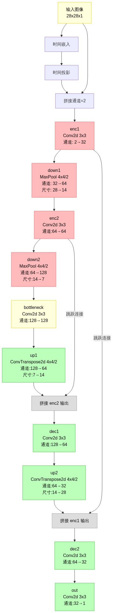
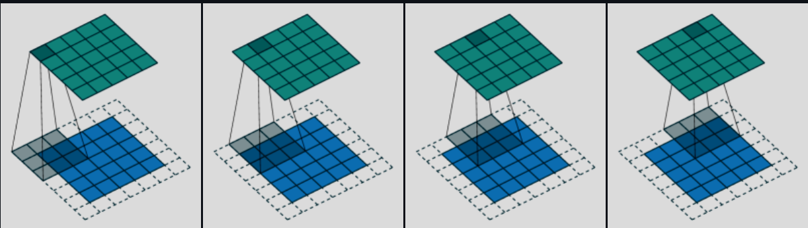
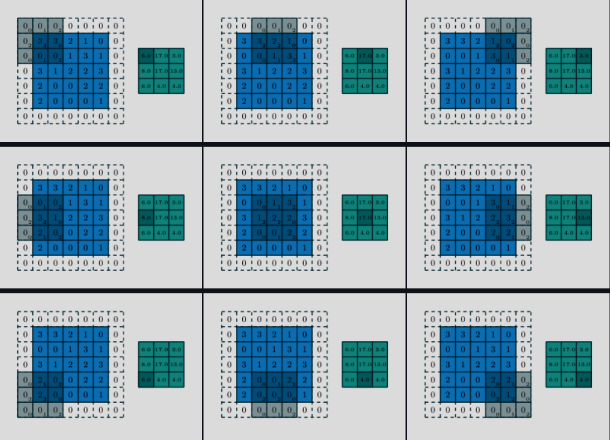
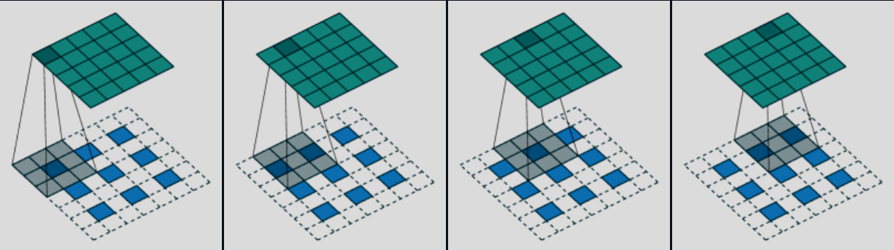

代码主要由几个部分组成，分别是文件加载器、ddpm主体、UNet神经网络及其训练和生成。

## 主体部分代码
```python
import sys, os
sys.path.append(os.path.abspath(".."))
from ddpm.data import get_loader
from ddpm.core import MyDDPM
from ddpm.train import training_loop
from ddpm.sampling import generate_new_images
from ddpm.visualize import show_images
from ddpm.models.tinyUnet import TinyUNet
from torch.optim import Adam
import torch

device = torch.device("cuda" if torch.cuda.is_available() else "cpu")

loader = get_loader(fashion=False, batch_size=128)

model = TinyUNet().to(device)
ddpm = MyDDPM(model, device=device)

training_loop(ddpm, loader, n_epochs=20, optim=Adam(ddpm.parameters(), 0.001), device=device, store_path="saved_models/tinyUnet_mnist.pt")

generated = generate_new_images(ddpm, n_samples=64, device=device, gif_name="gifs/tinyUnet_mnist.gif")
show_images(generated, "Final Results")
```
## ddpm的正向过程
首先先理解ddpm在做什么。

我们的目标是要把一个纯噪声“复原”成我们需要的数据，比如手写数字。

一步到位生成一张图片显然是不现实的。所以ddpm采用了逆向思维，通过不断向样本添加噪声，一步步将数据样本变成纯噪声。这个过程是完全可控的，称之为**正向过程**。

设$x_0$为数据样本，$x_T$为随机噪声,那么过程可以描述为:

> $x_0 ⟶ x_1 ⟶ x_2 ⟶ \cdots ⟶ x_t$

然后我们只需训练一个神经网络来预测正向过程每一步添加的噪声，就能通过将较不好的图片减去这个噪声来得到可能较好的图片,即从$x_t$还原到$x_0$。

从数学上，是这样定义正向过程的：
> $q(x_t|x_{t-1}) = \mathcal{N}(x_t; \sqrt{\alpha_t} x_{t-1}, \sqrt \beta_t I)$ 

其中：

- $\beta_t \in (0, 1)$ 是预设的噪声调度表
- $α_t=1−β_t$ 

两个参数物理意义分别是​​：
​
- $\beta_t$: 控制第t步添加的噪声量（破坏强度）
​
- $\alpha_t$: 控制上一步信号的保留程度（保真强度）

它们的取值策略称为**噪声调度**,一般来说$\alpha$随t逐渐下降.本次例会的代码的噪声调度采用$\alpha$和$\beta$线性变化的形式.

### 采样公式的推导

为了适合代码实现,我们需要进行一些数学推导.

$$
\begin{align}
x_t &= \sqrt \alpha x_{t-1} + \sqrt \beta \epsilon_t \\
&=\sqrt\alpha_t(\sqrt\alpha_{t-1}x_{t-2}+\sqrt\beta_{t-1}\epsilon_{t-1})+\sqrt\beta_t\epsilon_t\\
&= \cdots \\
&=\sqrt{\alpha_t\cdots\alpha_1}x_0 + \sqrt{\alpha_t\cdots\alpha_2}\sqrt\beta_1\epsilon_1+
\sqrt{\alpha_t\cdots\alpha_3}\sqrt\beta_2\epsilon_2+
\cdots+
\sqrt\alpha_t\sqrt\beta_{t-1}\epsilon_{t-1}+
\sqrt\beta_t\epsilon_t
\end{align}
$$

其中$\sqrt{\alpha_t\cdots\alpha_2}\sqrt\beta_1\epsilon_1+
\sqrt{\alpha_t\cdots\alpha_3}\sqrt\beta_2\epsilon_2+
\cdots+
\sqrt\alpha_t\sqrt\beta_{t-1}\epsilon_{t-1}+
\sqrt\beta_t\epsilon_t$正好是多个独立的正态噪声之和，其均值为0，方差则分别为$\alpha_t\cdots\alpha_2\beta_1$、$\alpha_t\cdots\alpha_3\beta_2$、$\cdots$、$\alpha_t\beta_{t-1}$、$\beta_t$。

然后，我们利用一个概率论的知识——正态分布的叠加性，即上述多个独立的正态噪声之和的分布，实际上是均值为0、方差为$\alpha_t\cdots\alpha_2\beta_1+\alpha_t\cdots\alpha_3\beta_2+\cdots+\alpha_t\beta_{t-1}+\beta_t$的正态分布。又由$\alpha_t+\beta_t=1$，可以得到
$$
\alpha_t\cdots\alpha_1+\alpha_t\cdots\alpha_2\beta_1+\alpha_t\cdots\alpha_3\beta_2+\cdots+\alpha_t\beta_{t-1}+\beta_t=1
$$
所以实际上化简后有
$$
x_t = \sqrt{\alpha_t\cdots\alpha_1}x_0 + \sqrt{1-\alpha_t\cdots\alpha_1}\overline{\epsilon_t},       \overline{\epsilon_t}\in\mathcal{N}(0,I) 
$$

这个式子称为**采样公式**,可以通过$\alpha_t\cdots\alpha_1$直接从$x_0$生成$x_t$。所以实际代码中我们直接用一个tensor存储不同t的$\alpha$的连续乘积，这样就能减少一部分的计算量。

## 正向过程的代码实现

```python
import torch
import torch.nn as nn
class MyDDPM(nn.Module):
    def __init__(self, network, n_steps=1000, min_beta=1e-4, max_beta=0.02, device=None, image_chw=(1, 28, 28)):
        super().__init__()
        self.n_steps = n_steps
        self.device = device
        self.image_chw = image_chw
        self.network = network.to(device) 
        # 主体神经网络（如UNet/MLP等），用于去噪预测
        # 线性生成每一步的beta（噪声强度），用于前向扩散过程
        # torch.linspace(start, end, steps) 会在 [start, end] 区间内，生成 steps 个等间隔的数。
        # 返回的是一个 一维张量，形状为 (n_steps,)
        self.betas = torch.linspace(min_beta, max_beta, n_steps).to(device)
        self.alphas = 1 - self.betas      # 每一步的alpha
        # alpha_bar为累计连乘积，表示每一步的总保留比例
        self.alpha_bars = torch.tensor([torch.prod(self.alphas[:i + 1]) for i in range(n_steps)]).to(device)

    def forward(self, x0, t, eta=None):
        n, c, h, w = x0.shape
        a_bar = self.alpha_bars[t]

        if eta is None:
            eta = torch.randn(n, c, h, w).to(self.device)
        # 按照扩散公式加噪声，生成第t步的noisy图像
        noisy = a_bar.sqrt().reshape(n, 1, 1, 1) * x0 + (1 - a_bar).sqrt().reshape(n, 1, 1, 1) * eta
        return noisy

    def backward(self, x, t):
        # 用网络预测去噪
        return self.network(x, t)
```

值得注意的是forward方法中$\alpha_t\cdots\alpha_0$是通过``alpha_bar[t]``获取的.所以shape为(n,),不能直接与shape为(n,c,h,w)的$x_0$和$eta$相乘,需用``reshape``方法调整为(n,1,1,1)。

## UNet模型

正向过程搞定了,那么要用神经网络来预测噪声了。这里采用的是简化的UNet模型。

UNet在基础的编码器-解码器结构上,添加了卷积、时间步嵌入和跳跃连接等特点.

代码主体架构如下:



### 时间步嵌入

首先，这个神经网络要做的是从$x_t$到$x_0$的工作，所以它是与不同t是相关的，也就是它要根据不同的t对图像进行不同力度的调整。

那么怎么做呢？如果时间步仅仅是个标量，模型难以察觉不同时间步之间的区别。

所以我们让每个时间步索引唯一地对应一个时间嵌入向量，这样模型就能较轻松学习到不同时间步的差别和调整大小了。这个步骤用专业名词来说就是**时间步嵌入**。

这里用的是一种叫做正弦位置编码的方式来生成时间嵌入向量。(稍微简化过的)

给定时间步索引 $t$（标量）和嵌入维度 $d$，生成的时间嵌入向量 $\text{emb}(t)$ 由以下公式定义：

$$
\text{emb}(t) = \left[ \sin\left( t \cdot \omega_k \right), \cos\left( t \cdot \omega_k \right), \cdots \right]_{k=0}^{d//2-1}
$$
其中$\omega_k$是：
$$
\omega_k =  (\frac{1}{10000})^{\frac{2k}{d}}
$$
#### 正弦位置编码的代码实现
```python
import torch
def sinusoidal_embedding(n, d):
    embedding = torch.zeros(n, d)
    #torch.zeros(n, d)创建一个n行d列的全零矩阵
    wk = torch.tensor([1 / 10_000 ** (2 * j / d) for j in range(d)]).reshape(1, d)
    #wk是一个1行d列的张量，包含了每个维度的权重    
    #前面部分默认形状是(d,)的一维张量，所以用reshape(1, d)将其转换为1行d列的张量
    t = torch.arange(n).reshape(n, 1)
    #torch.arange(n)创建一个从0到n-1的张量，默认形状为(n,)
    #reshape(n, 1)将其转换为n行1列的张量          

    #[:, ::2]是偶数索引位置
    #[:, 1::2]是奇数索引位置
    embedding[:, ::2] = torch.sin(t * wk[:, ::2])
    embedding[:, 1::2] = torch.cos(t * wk[:, 1::2])0
    
    return embedding
```

#### 时间嵌入和时间投影

在UNet代码中，将正弦位置编码得到tensor放入嵌入层time_embed中.就能通过``time_embed[t]``获取对应时间嵌入向量.

虽然初始的正弦嵌入(代码中的time_embed)已经包含时间信息，但它是固定的、线性变换的表示.

所以需再添加一层神经网络(代码中的time_proj)来让神经网络学习不同时间步之间的关系,增加非线性映射能力.这步叫做**时间投影**

在UNet类中如此实现:
```python
 self.time_embed = nn.Embedding(n_steps, time_emb_dim)
        self.time_embed.weight.data = sinusoidal_embedding(n_steps, time_emb_dim)
        self.time_embed.requires_grad_(False)

        self.time_proj = nn.Sequential(
            nn.Linear(time_emb_dim, 28 * 28),
            nn.SiLU()
        )
```

在forward方法中通过``self.time_proj(self.time_embed(t)).view(n, 1, 28, 28)``获取时间嵌入向量即可(注意,time_proj输出shape为(n,28,28),所以需变化一下)

### 下采样

在将输入图像x与时间嵌入向量拼接后,就来到了编码器.

通过前面的流程图可以看到,图片的尺寸逐渐变小,而通道数逐渐增加.

这个信息逐渐压缩的过程称为**下采样**.

在这部分,重要的是提取出图像中的特征.所以自然就用到了**卷积**.



在图片逐渐压缩的每一步中,我们都用卷积来提取当前尺寸的特征(后面跳跃连接也会用到),然后再下采样到下一步.

这里下采样的代码通过将卷积的步长设置为2来实现分辨率减半.

效果如下图片（仅仅是展示步长为2的效果）



具体代码如下:
```python
self.enc1 = nn.Sequential(
            nn.Conv2d(2, 32, 3, padding=1),
            nn.SiLU()
        )
#下采样1
self.down1 = nn.Conv2d(32, 64, 4, stride=2, padding=1)  # → (14x14)
self.enc2 = nn.Sequential(
            nn.SiLU(),
            nn.Conv2d(64, 64, 3, padding=1),
            nn.SiLU()
        )
#下采样2
self.down2 = nn.Conv2d(64, 128, 4, stride=2, padding=1)  # → (7x7)
```

### 上采样

与下采样相对应,解码器中有**上采样**.

上采样会增加图片的尺寸,同时减少通道数.这里使用**转置卷积**来实现.

效果大致如下：



但是由于下采样会丢失空间细节.

所以UNet将编码器对应尺寸的原始细节信息直接**跳跃连接**至解码器对应部分,与解码器前面输出信息进行拼接.然后通过对应卷积层融合信息.

如在代码中``dec1``的输入是``enc2``和``up1``输出的拼接.``dec2``输入就是``enc1``和``up2``输出的拼接.


### UNet类完整代码
```python
import torch.nn as nn
import torch
from ddpm.utils import sinusoidal_embedding


class TinyUNet(nn.Module):
    def __init__(self, n_steps: int = 1000, time_emb_dim: int = 100):
        """
        简化版U-Net结构扩散模型
        参数:
            n_steps (int): 扩散步数，决定时间嵌入的范围。
            time_emb_dim (int): 时间步嵌入的维度。
        """
        super().__init__()

        # 时间步嵌入，使用正弦位置编码初始化，不参与训练
        self.time_embed = nn.Embedding(n_steps, time_emb_dim)
        self.time_embed.weight.data = sinusoidal_embedding(n_steps, time_emb_dim)
        self.time_embed.requires_grad_(False)

        # 时间步嵌入投影为特征图，输出shape: (batch, 1, 28, 28)
        self.time_proj = nn.Sequential(
            nn.Linear(time_emb_dim, 28 * 28),
            nn.SiLU()
        )

        # 编码器部分
        self.enc1 = nn.Sequential(
            nn.Conv2d(2, 32, 3, padding=1),
            nn.SiLU()
        )
        self.down1 = nn.Conv2d(32, 64, 4, stride=2, padding=1)  # → (14x14)
        self.enc2 = nn.Sequential(
            nn.SiLU(),
            nn.Conv2d(64, 64, 3, padding=1),
            nn.SiLU()
        )
        self.down2 = nn.Conv2d(64, 128, 4, stride=2, padding=1)  # → (7x7)

        # 瓶颈层
        self.bottleneck = nn.Sequential(
            nn.SiLU(),
            nn.Conv2d(128, 128, 3, padding=1),
            nn.SiLU()
        )

        # 解码器部分
        self.up1 = nn.ConvTranspose2d(128, 64, 4, stride=2, padding=1)  # → 14x14
        self.dec1 = nn.Sequential(
            nn.SiLU(),
            nn.Conv2d(128, 64, 3, padding=1)
        )
        self.up2 = nn.ConvTranspose2d(64, 32, 4, stride=2, padding=1)  # → 28x28
        self.dec2 = nn.Sequential(
            nn.SiLU(),
            nn.Conv2d(64, 32, 3, padding=1)
        )

        self.out = nn.Conv2d(32, 1, 3, padding=1)

    def forward(self, x: torch.Tensor, t: torch.Tensor) -> torch.Tensor:
        """
        前向传播
        参数:
            x (torch.Tensor): 输入图像，shape (batch, 1, 28, 28)
            t (torch.Tensor): 时间步索引，shape (batch,) 或 (batch, 1)
        返回:
            torch.Tensor: 输出去噪残差，shape (batch, 1, 28, 28)
        """
        n = x.size(0)
        t = t.view(-1) #统一时间步索引为（batch，）
        # 获取时间步嵌入并投影为特征图
        t_emb = self.time_proj(self.time_embed(t)).view(n, 1, 28, 28)
        # 拼接原图和时间特征作为卷积输入
        x = torch.cat([x, t_emb], dim=1)  # (n,1,28,28) + (n,1,28,28) ⟶ (n, 2, 28, 28)
        x1 = self.enc1(x)           #(n,2,28,28)  ⟶ (n,32,28,28)
        x1_down = self.down1(x1)    #(n,32,28,28) ⟶ (n,64,14,14)
        x2 = self.enc2(x1_down)     #(n,64,14,14) ⟶ (n,64,14,14)
        x2_down = self.down2(x2)    #(n,64,14,14) ⟶ (n,128,7,7)
        x3 = self.bottleneck(x2_down)
        u1 = self.up1(x3)           #(n,128,7,7)  ⟶ (n,64,14,14)
        u1_cat = torch.cat([u1, x2], dim=1) #(n,64,14,14)+(n,64,14,14)⟶(n,128,14,14)
        u1 = self.dec1(u1_cat)      #(n,128,14,14)⟶ (n,64,14,14)
        u2 = self.up2(u1)           #(n,64,14,14) ⟶ (n,32,28,28)
        u2_cat = torch.cat([u2, x1], dim=1)#(n,32,28,28)+(n,32,28,28)⟶(n,64,28,28)
        u2 = self.dec2(u2_cat)      #(n,64,28,28) ⟶ (n,32,28,28)
        out = self.out(u2)          #(n,32,28,28) ⟶ (n,1,28,28)
        return out
```
## 训练模型

接下来就是训练UNet的代码

损失采用了均方误差损失函数(MSE)。其数学公式为:

$$
 \text{MSE} = \frac{1}{n} \sum_{i=1}^{n} (y_i - \hat{y}_i)^2 
$$

直接用pytorch的相关方法即可。

```python
import torch
import torch.nn as nn
import os
from tqdm.auto import tqdm
from ddpm.visualize import show_images
from ddpm.sampling import generate_new_images

def training_loop(ddpm, loader, n_epochs, optim, device, display=False, store_path="ddpm_model.pt"):
    # 定义均方误差损失函数
    mse = nn.MSELoss()
    best_loss = float("inf")  # 记录最佳损失
    n_steps = ddpm.n_steps    # 扩散步数
    # 确保保存模型的目录存在
    os.makedirs(os.path.dirname(store_path), exist_ok=True)

    for epoch in tqdm(range(n_epochs), desc="Training progress", colour="#00ff00"):
        epoch_loss = 0.0
        # 遍历数据集的每个batch
        for step, batch in enumerate(tqdm(loader, leave=False, desc=f"Epoch {epoch + 1}/{n_epochs}", colour="#005500")):
            x0 = batch[0].to(device)  # 原始图片
            n = len(x0)

            # 随机生成噪声，形状与x0一致
            eta = torch.randn_like(x0).to(device)
            # 随机采样每张图片的扩散步数t
            t = torch.randint(0, n_steps, (n,)).to(device)
            # 正向扩散：将原图x0加噪声eta，得到第t步的noisy_imgs
            noisy_imgs = ddpm(x0, t, eta)
            # 反向过程：用模型预测噪声（去噪），输出eta_theta
            eta_theta = ddpm.backward(noisy_imgs, t.reshape(n, -1))

            # 损失函数：预测噪声与真实噪声的均方误差
            loss = mse(eta_theta, eta)
            optim.zero_grad()      # 梯度清零
            loss.backward()       # 反向传播
            optim.step()          # 更新参数

            # 累加本轮损失（按样本数加权平均）
            epoch_loss += loss.item() * len(x0) / len(loader.dataset)

        if display:
            show_images(generate_new_images(ddpm, device=device), f"Images generated at epoch {epoch + 1}")

        log_string = f"Loss at epoch {epoch + 1}: {epoch_loss:.3f}"

        # 如果本轮损失更优，则保存模型
        if best_loss > epoch_loss:
            best_loss = epoch_loss
            torch.save(ddpm.state_dict(), store_path)
            log_string += " --> Best model ever (stored)"

        print(log_string)
```

## 生成图片

生成图片时我们只需将预测的噪声代入采样公式，稍做变形，就可以得到理论上被加噪声前的“好图片”了。

具体来说，将采样公式（$x_t = \sqrt{\alpha_t\cdots\alpha_1}x_0 + \sqrt{1-\alpha_t\cdots\alpha_1}\overline{\epsilon_t},\overline{\epsilon_t}\in\mathcal{N}(0,I)$ ）中$\overline{\epsilon_t}$替换为UNet生成的噪声,再将$x_0$移至一边。得到**反向扩散公式**:
$$
x_0 = \frac{ x_t - (1-\alpha_t)\cdot\overline{\epsilon_t}}{\sqrt{1-\alpha_t\cdots\alpha_1}}
$$

另外这里添加了生成gif来展示生成过程
```python
import torch
import numpy as np
import einops
import imageio

@torch.no_grad()
def generate_new_images(ddpm, n_samples=16, device=None, frames_per_gif=100, gif_name="sampling.gif", c=1, h=28, w=28):
    """
    采样生成新图像，并保存采样过程为GIF动图。
    参数：
        ddpm: 训练好的DDPM模型
        n_samples: 生成样本数
        device: 计算设备
        frames_per_gif: GIF帧数
        gif_name: GIF文件名
        c, h, w: 图像通道数和尺寸
    返回：
        x: 最终生成的图像张量
    """
    # 采样过程中要保存的帧索引
    frame_idxs = np.linspace(0, ddpm.n_steps, frames_per_gif).astype(np.uint)
    frames = []

    if device is None:
        device = ddpm.device

    # 从高斯噪声开始采样
    x = torch.randn(n_samples, c, h, w).to(device)

    # 反向扩散过程，从纯噪声逐步去噪
    for idx, t in enumerate(list(range(ddpm.n_steps))[::-1]):
        # 构造当前步的时间张量
        time_tensor = (torch.ones(n_samples, 1) * t).to(device).long()
        # 用模型预测噪声
        eta_theta = ddpm.backward(x, time_tensor)

        # 获取当前步的alpha和alpha_bar
        alpha_t = ddpm.alphas[t]
        alpha_t_bar = ddpm.alpha_bars[t]

        # 反向扩散公式，去噪一步
        x = (1 / alpha_t.sqrt()) * (x - (1 - alpha_t) / (1 - alpha_t_bar).sqrt() * eta_theta)

        # 除最后一步外，每步都加一点高斯噪声
        if t > 0:
            z = torch.randn(n_samples, c, h, w).to(device)
            beta_t = ddpm.betas[t]
            sigma_t = beta_t.sqrt()
            x = x + sigma_t * z

        # 保存采样过程中的部分帧用于生成GIF
        if idx in frame_idxs or t == 0:
            normalized = x.clone()
            for i in range(len(normalized)):
                normalized[i] -= torch.min(normalized[i])
                normalized[i] *= 255 / torch.max(normalized[i])

            # 将batch的图片拼成大图
            frame = einops.rearrange(normalized, "(b1 b2) c h w -> (b1 h) (b2 w) c", b1=int(n_samples ** 0.5))
            frame = frame.cpu().numpy().astype(np.uint8)
            frames.append(frame)

    # 保存GIF动图
    with imageio.get_writer(gif_name, mode="I") as writer:
        for idx, frame in enumerate(frames):
            rgb_frame = np.repeat(frame, 3, axis=2)
            writer.append_data(rgb_frame)
            # 最后一帧多展示一会
            if idx == len(frames) - 1:
                for _ in range(frames_per_gif // 3):
                    writer.append_data(rgb_frame)
    return x
```

## 其他

还有文件加载和展示图片部分代码未展示，详见社团[github代码仓库](https://github.com/NJU-AIA)中.

里面还有用残差块等其他结构实现的ddpm可供参考。

## 参考文章


- [苏剑林. (Jun. 13, 2022). 《生成扩散模型漫谈（一）：DDPM = 拆楼 + 建楼 》](https://spaces.ac.cn/archives/9119)

- [[1603.07285]A guide to convolution arithmetic for deep learning](https://doi.org/10.48550/arXiv.1603.07285)