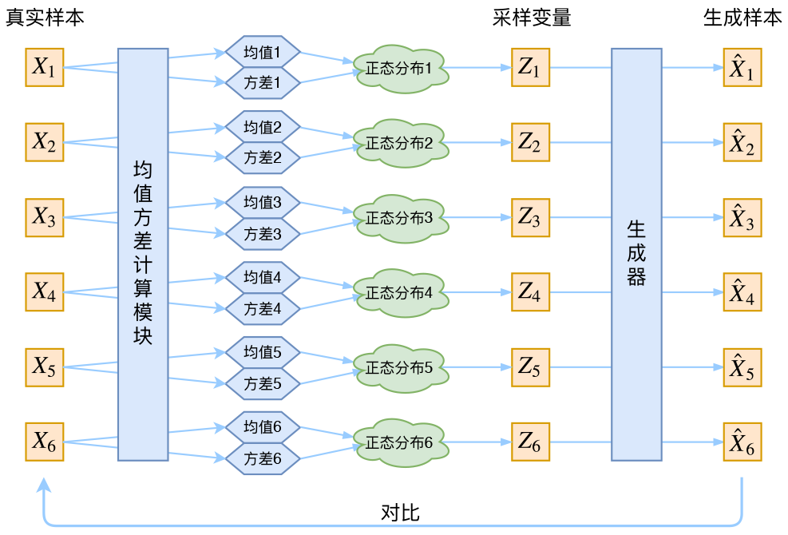
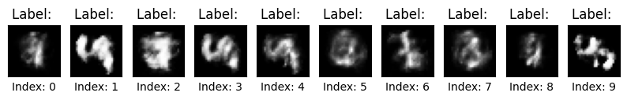

##  自编码器的问题

为什么之前实现的简单自编码器的重构效果尚可，但是生成能力很差呢？并且隐空间的维度越高，采样就越困难，这又是为什么？编码器和解码器的结构过于简单可能是一个原因，但是更重要的问题出在其中的数学原理。

回顾一下我们用自编码器做了什么：


1. 定义编码器 $E$ 将高维的输入 (784 维的图片) $x$ 编码成低维特征向量 $z=E(x)$ ，希望尽可能保留输入中的重要信息。

2. 定义解码器 $D$ 使用 $z$ 重构数据，并且希望重构的数据和原始输入尽可能相等，即 $x≈D(E(x))$ 。
3. 训练模型，使其达到良好的重构效果。
4. 然后我们肉眼观察 $z$ 的分布，猜测其为一个正态分布。
5. 最后对其进行采样，试图用采样得到的 $z$  通过解码器得到新的数据。

发现其中的问题了吗？

首先肉眼观察分布是个很奇怪的事情，$z$ 看起来是正态分布，实际上是什么分布谁也不知道。并且它也不能真的是一个正态分布，否则他就和输入无关，也就是说编码器没有保留原始数据的信息，那解码器如何学会重构呢？

但是，我们进行采样生成的时候，肯定希望从一个常见的先验分布进行采样，希望 $z$  的分布不依赖于原始数据。这又是确确实实地把编码器扔掉了，也就是说我们希望解码器可以独当一面，不依赖于编码器对于具体的输入提取的特征。

这就矛盾了，我们训练的时候需要编码器提供的特征信息，但是解码的时候又希望脱离编码器，有什么解决办法吗？

直接训练一个从纯噪声（标准正态分布）解码的解码器行不行？这就不会产生矛盾了。

 

恐怕没有那么简单，因为我们没有办法通过一个简单的指标来判断生成的效果。其困难在于，我们并不知道输出应该和哪个训练数据进行比较，不像我们之前训练的自编码器，直接计算模型输入和输出的均方误差即可。

虽然这很困难，但也不是没有办法。比如 GAN 的思路很直接粗犷：既然没有合适的度量，那我干脆把这个度量也用神经网络训练出来吧。而我们要讲的 VAE，则使用了一个精致迂回的技巧。

不过先别急，我们来一步一步解决 AE 存在的问题。

## 由点到面

我们发现，隐空间的维度越高，采样就越困难。这可能是因为 **高维空间的稀疏性**——在低维空间中，数据点之间的距离较小，而在高维空间中，数据点之间的距离会迅速增加，使得随机采样的 $z$ 更容易落入未见过的区域。

直观的讲，用很多的点来代表一个高维空间的分布听起来就是件不靠谱的事情，毕竟再多的点也无法覆盖一个空间。但是如果用“面”来覆盖空间就简单多了，所以变分自编码器引入了后验分布 $p(z|x)$   

  

原来每个样本对应着一个编码向量，也就是编码空间中的一个点，引入后验分布之后，相对于说现在每个样本 $x$ 都对应一个“椭圆”。

> 使用“椭圆”是因为它对应着“各分量独立的高斯分布”，众所周知，高斯分布是比较容易处理的概率分布。

这样的话，编码器的输出是什么呢？

显然是椭圆的圆心（均值）, 以及椭圆各个维度的半径（方差），所以模型变成了下面的样子：

> 注意虽然我们规定 $p(z|x)$ 是一个正态分布，但是并不知道 $p(z)$ 的分布是什么

 

相应的，解码器每次在编码器输出的正态分布（椭圆）中进行采样，得到对应的 $z$  之后进行解码，输出重构后的图片。

我们仍然可以用解码器的输出和原始数据之间的差异作为指标来训练模型
$$
Loss = ∥x−D(μ(x)+ε⊗σ(x))∥^2
$$
可以这样理解：编码器给解码器添加了一些噪声，训练解码器重构带噪声的隐变量 $z$ , 从而加强其生成能力。

理论的事情说了这么多，来实践一下看看效果

[点击这里直接看结果](#效果好像不太好)

### 模型定义

```python
class VAE(AutoEncoder):
    def __init__(self):
        super().__init__()
        # Add mu and log_var layers for reparameterization
        self.mu = nn.Linear(self.num_hidden, self.num_hidden)
        self.log_var = nn.Linear(self.num_hidden, self.num_hidden)

    def reparameterize(self, mu, log_var):
        # Compute the standard deviation from the log variance
        std = torch.exp(0.5 * log_var)
        # Generate random noise using the same shape as std
        eps = torch.randn_like(std)
        # Return the reparameterized sample
        return mu + eps * std

    def forward(self, x):
        # Pass the input through the encoder
        encoded = self.encoder(x)
        # Compute the mean and log variance vectors
        mu = self.mu(encoded)
        log_var = self.log_var(encoded)
        # Reparameterize the latent variable
        z = self.reparameterize(mu, log_var)
        # Pass the latent variable through the decoder
        decoded = self.decoder(z)
        # Return the encoded output, decoded output, mean, and log variance
        return encoded, decoded, mu, log_var

    def sample(self, num_samples):
        with torch.no_grad():
            # Generate random noise
            z = torch.randn(num_samples, self.num_hidden).to(device)
            # Pass the noise through the decoder to generate samples
            samples = self.decoder(z)
        # Return the generated samples
        return samples
```

### 训练

```python
for epoch in range(num_epochs):
    total_loss = 0.0
    for batch_idx, data in enumerate(train_loader):
        # Get a batch of training data and move it to the device
        data = data.to(device)
        encoded, decoded, mu, log_var = model(data)
        loss = criterion(decoded, data) 
        optimizer.zero_grad()
        loss.backward()
        optimizer.step()
        total_loss += loss.item() * data.size(0)
    epoch_loss = total_loss / len(train_loader.dataset)
    print(
        "Epoch {}/{}: loss={:.4f}".format(epoch + 1, num_epochs, epoch_loss)
    )
```

### 效果好像不太好

训练完成了，来看看效果：

先看看 Loss

```bash
Epoch 1/10: loss=1253.6249
Epoch 2/10: loss=959.0322
Epoch 3/10: loss=837.9456
Epoch 4/10: loss=799.1609
Epoch 5/10: loss=777.4000
Epoch 6/10: loss=763.2662
Epoch 7/10: loss=752.5686
Epoch 8/10: loss=744.1388
Epoch 9/10: loss=737.3690
Epoch 10/10: loss=731.5162
```

看看重构效果：

 

 

虽然没有太多提升，但是还算可以接受，最后看看生成能力，我们在 $N(0,1)$  进行采样，并且用解码器生成图片

 

啊，怎么会这样？

## 小剧场

如果我们只用解码器的输出和编码器的输入之间的差异作为评价指标 (Loss) 进行训练会发生什么呢？

我想可能会发生下面的情景：

### 想要摸鱼的解码器

**解码器（委屈）：** 

> “都怪你！每次都给我加噪声，我根本画不出清晰的图片！”

**编码器（温柔）：** 

> “这可是为了让你更强呀。如果你能适应不同的 `z`，以后就能画出更多样的图像了。”

**解码器（不满）：**

> “可是我现在画得乱七八糟的！要不你别加噪声了，给我稳定点的 `z`！”

**编码器（无奈）：**

> “这样的话…… 好吧，我把 `z` 变成固定的，让你画得轻松些。”

------

### 编码器的让步 

**解码器（满意）：**

> “哈哈，这下好了！`z` 每次都一样，我终于可以精准重现输入了！”

**编码器（轻声）：**

> “嗯嗯，你再试试看吧。”

------

### 意料之中的结果 

**解码器（疑惑）：** 

> “等一下…… 为什么我生成的图片基本上都是乱码？”

**编码器（平静）：**

> “当然啊，方差变成 0，你不就和 AE 里面的解码器一样了吗？”

**解码器（惊慌）：**

> “那…… 那我不是只能复读训练集？我没办法画新图了？”
>
> “……我们变成了一个复读机。”

简而言之，噪声会增加重构的难度，不过好在这个噪声强度（也就是方差）是通过编码器的神经网络算出来的，所以最终模型为了重构得更好，肯定会想尽办法让方差为 0。而方差为 0 的话，也就没有随机性了，所以不管怎么采样其实都只是得到确定的结果（也就是均值）

说白了，模型会慢慢退化成普通的 AutoEncoder，噪声不再起作用。

## 空间正则

为了防止模型退化，需要给模型另一些评价指标，VAE 选择让每一个 $p(z|x)$  的分布去接近一个标准正态分布。

这样有什么好处呢？


这样的话，不只是 $p(Z|X)$ ，$p(Z)$  也会是一个正态分布  
$$
p(Z)=\sum_Xp(Z|X)p(X)=\sum_XN(0, I)p(X)= N(0, I)\sum_Xp(X)= N(0, I)
$$

那就可以放心地在 $N(0,1)$ 这个分布中采样了，相信大家肯定和我一样无法忍受用肉眼观察 Z 的分布是什么。

如何选择这个指标呢？一个简单的方案如下：


$$
L_μ = μ^2 \\
L_{σ2}= (\log σ^2)^2
$$
但是这样的话很难去选取这两个损失的比例，一个更好的选择是使用 KL 散度作为这个额外的 loss:
$$
KL(N(μ, σ2)||N(0, I))\\=
\frac{1}{2}\sum_{i = 1}^d(μ^2(i)+σ^2(i)−\log σ^2(i)−1)
$$
不了解 KL 散度没有关系，你只需要知道它可以用来衡量两个分布的差异。

## VAE

现在把两个 Loss 结合起来，就得到了变分自编码器 （VAE）
$$
∥x−D(μ(x)+ε⊗σ(x))∥^2+
\frac{1}{2}\sum_{i = 1}^d(μ^2(i)+σ^2(i)−\log σ^2(i)−1) \qquad ε∼N(0,1)
$$
前面的 MSE loss 表示解码器输出的结果 $D(μ(x)+ε⊗σ(x))$ 和原始数据 $x$ 之间的差异，用来衡量重构的效果
后面的 KL loss 表示解码器输出的分布和标准正态分布之间的差异，用来维持噪声的强度

这两个 Loss 是相互对抗的，重构的过程是希望没噪声的，而 KL loss 则希望有高斯噪声的：

当 decoder 还没有训练好时（重构误差远大于 KL loss），就会适当降低噪声（KL loss 增加），使得拟合起来容易一些（重构误差开始下降）；反之，如果 decoder 训练得还不错时（重构误差小于 KL loss），这时候噪声就会增加（KL loss 减少），使得拟合更加困难了（重构误差又开始增加），这时候 decoder 就要想办法提高它的生成能力了。

> 是不是可以续写一下上面的小剧场呢？

不知不觉，我们好像已经解决了 AE 的很多问题：

- 让编码器生成分布，而不是一个点，来解决高维空间采样困难的问题
- 将编码器的输出规范为标准正太分布，从而可以放心地在 $N(0,1)$ 采样

但是在进行图像生成的时候，解码器没有了编码器的帮助，还能完成这个艰巨的任务吗？

看起来是可以的，因为解码器在训练的时候，就是一直在编码器提供的正态分布里面进行采样的，不过还是那句话，talk is cheap, 我们来训练一个 VAE 模型看看效果吧！

限于篇幅，完整代码可以在社团仓库下载。和原来相比，我们只是对 Loss 进行了一点修改

[点击这里直接看结果](#看看效果) 

```python
for epoch in range(num_epochs):
    total_loss = 0.0
    for batch_idx, data in enumerate(train_loader):
        # Get a batch of training data and move it to the device
        data = data.to(device)

        # Forward pass
        encoded, decoded, mu, log_var = model(data)

        # Compute the loss and perform backpropagation
        KLD = -0.5 * torch.sum(1 + log_var - mu.pow(2) - log_var.exp())
        loss = criterion(decoded, data) + 3 * KLD
        optimizer.zero_grad()
        loss.backward()
        optimizer.step()

        # Update the running loss
        total_loss += loss.item() * data.size(0)

    # Print the epoch loss
    epoch_loss = total_loss / len(train_loader.dataset)
    print(
        "Epoch {}/{}: loss={:.4f}".format(epoch + 1, num_epochs, epoch_loss)
    )
```

## 看看效果

```bash
Epoch 1/10: loss=1714.9480
Epoch 2/10: loss=1573.2981
Epoch 3/10: loss=1531.8248
Epoch 4/10: loss=1504.1819
Epoch 5/10: loss=1480.4726
Epoch 6/10: loss=1458.2038
Epoch 7/10: loss=1441.5974
Epoch 8/10: loss=1429.9425
Epoch 9/10: loss=1420.5563
Epoch 10/10: loss=1411.3642
```

先来看看重构的效果：

 

好像，重构的效果变差了。

不过好消息是这次我们可以放心地在 $N(0,1)$ 进行采样了，我们得到了下面的结果

 

好在这次生成的效果还算不错。

有个有趣的事情是，生成的图像有点像几个数字的融合。我们不妨来试试，从一个随机向量开始，逐渐改变它的一个分量，同时保持其他分量不变：

 

酷！你可以看到 8 在一步步过渡到 3 ，这说明什么？

这说明我们的 decoder 其实学会了怎么画出所有的数字，它可以把隐空间的不同维度，不同方向对应到不同数字的特征。

而它画出的模糊不可辨认的图片，很可能是两个数字的过渡状态。

## 最后

或许你还是有点失望，我们似乎只是把采样空间给规范化了一点，泛化能力提高了一点点，生成图像的质量没有太多提升。

但其实规范采样空间和提升泛化能力的意义是很大的，唯心的讲，这表明我们的模型真正学到了点东西，而不是简单的复读机或者压缩程序。

当然，我们的模型过于简单，参数量也不大，数据集也不够好，你有很多方式可以提高模型的生成效果，比如：

- 增加训练轮次
- 增大隐空间维度
- 优化训练集
- 修改 Loss 的比例
- ……

这就是所谓的炼丹了

不过我们的模型生成的图片几乎是随机的，有没有办法让模型生成指定数字的图片呢？

### 引用声明

本文章参考了以下文章和资料，特此致谢。所有引用内容归原作者所有，如有侵权，请联系删除。

1. [变分自编码器（六）：从几何视角来理解VAE的尝试 - 科学空间|Scientific Spaces](https://spaces.ac.cn/archives/7725) 。
2. [变分自编码器（一）：原来是这么一回事 - 科学空间|Scientific Spaces](https://spaces.ac.cn/archives/5253) 

代码参考 [Implementing Variational Autoencoders from scratch | by Konstantin Sofeikov | Medium](https://medium.com/@sofeikov/implementing-variational-autoencoders-from-scratch-533782d8eb95)  


