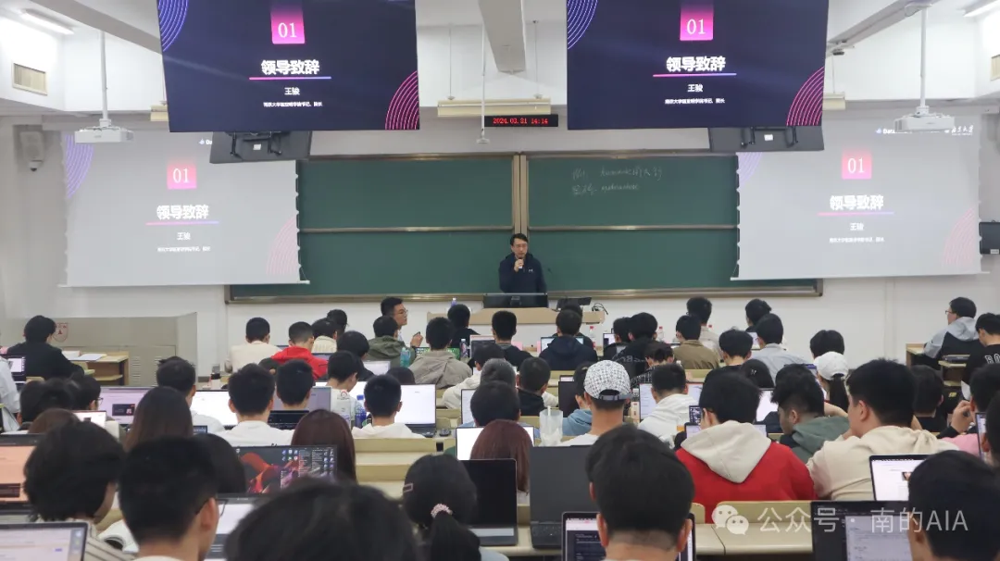
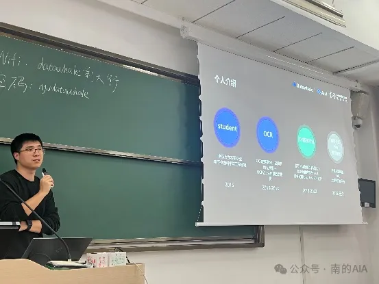
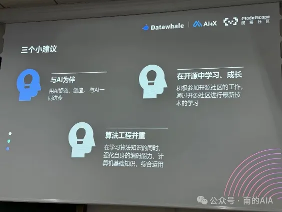
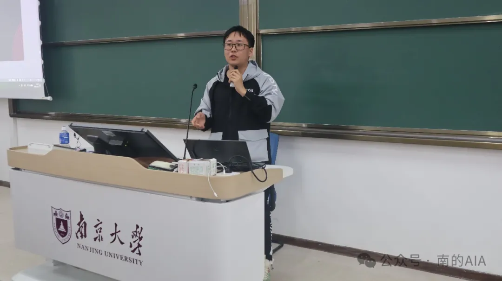
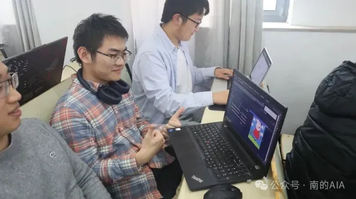
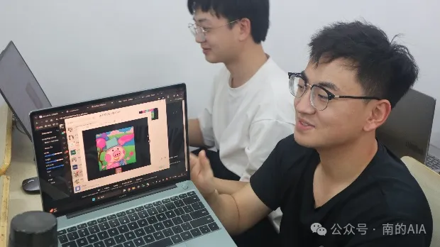
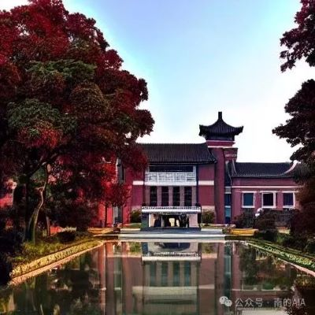

 

2024年3月31日下午，Datawhale AI + X 高校行「南大场」于仙林校区择善楼顺利举行。南京大学匡亚明学院书记、院长王骏，南京大学匡亚明学院，南京大学人工智能学院等单位党政领导及学生工作负责人，来自不同专业的众多学生参加活动。本次AI+X由Datawhale主办，南京大学匡亚明学院、南京大学人工智能学院联合主办，南京大学人工智能学院学生会、南京大学人工智能协会承办，驱动云、人民邮电出版社、OpenI启智、智海Mo协办。

王骏在此次活动开始前致辞。

阿里巴巴通义实验室的研发总监周文猛先生荣幸地为我们进行了精彩的开场分享。作为南京大学的校友，周先生回顾了自己的学习和成长经历，并且针对学习过程中的策略，为在座的学弟学妹们提供了三个富有洞察力的建议。周文猛先生的经历和见解，不仅激发了在场同学的学习热情，也为他们的未来发展提供了宝贵的指导。

稍后，在本次活动中，来自南京大学匡亚明学院的研究生谢聪将指导在座的各位如何亲自操作和实践大型模型。这一环节将为大家提供实际操作的机会，帮助深入理解大模型的运作和应用。(教程在文末)

接下来，活动中举行了一场AI绘图比赛，参赛的同学们热情地创作了与“南京”或“南大”相关的图画。作品由评委团和公众通过投票选出，最终五幅最受欢迎的作品脱颖而出。

在活动的尾声，我们举办了一场精彩的抽奖活动，并特邀优秀企业领袖及学生代表上台进行交流。出席此次活动的嘉宾包括Datawhale南京分部的负责人杨煜、阿里魔搭社区运营负责人石洪竺、趋动科技运营总监文禹翔、燧原科技生态战略总监余丹，以及南京大学人工智能协会的负责人李尚敖，他们与在场同学们分享了宝贵经验和见解。

[阅读原文](https://mp.weixin.qq.com/s/qv2DSNsO4orSkRUeBSPx6g)
