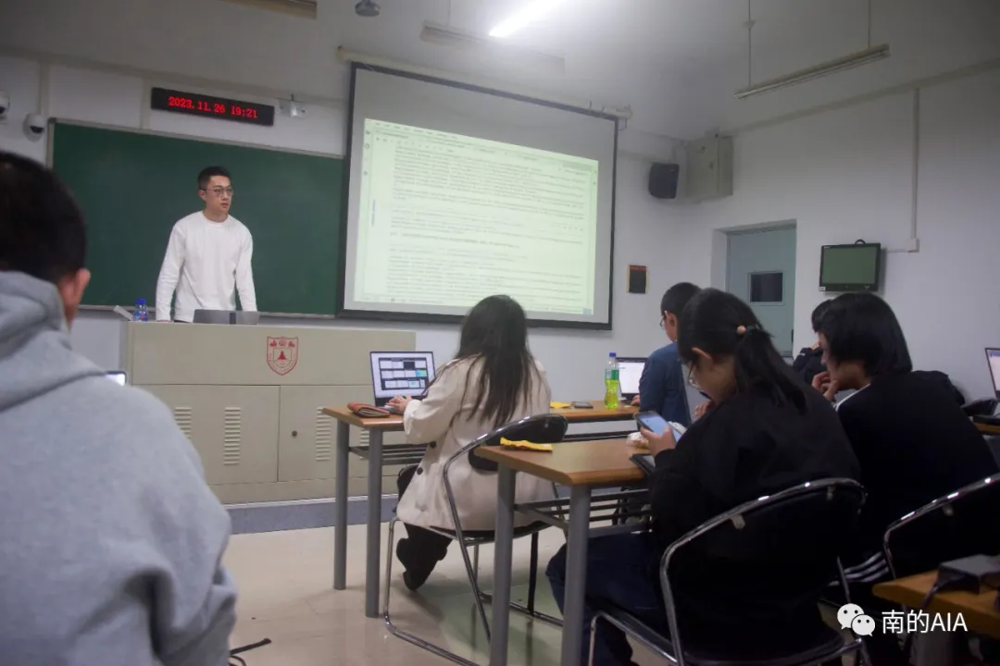

2023年11月26日，南大AIA在南京大学仙林校区举办了本学期第一次技术例会。本次例会与未来开发者协会合作开展，内容主要关于LangChain Agent开发的入门学习。





## 开发环境的安装和演示

o 这部分内容包括了Python环境的设置、JupyterLab笔记本的安装以及额外库的安装。

o 展示了如何连接到在线大型语言模型（LLM）服务，并测试安装以便准备接下来的教程。


## 大语言模型（LLM）基础

o 介绍了LLM的基础知识，包括开发者视角下的LLM基本接口（Prompt-Completion）和自动回归式的生成过程。

o 提及了LLM的强大之处，尤其是在提供文本指令以完成各种任务时的能力，如回答科学问题、概括段落、提出产品名称、撰写研究论文大纲等。


## LangChain介绍

o LangChain是为了解决LLM的局限性而开发的模块化框架，这些局限性包括虚构事实、知识断点、无法访问最新信息、无法访问专有信息源、有限的上下文窗口等。

o LangChain支持上下文感知和基于LLM的推理，以及一系列模块化设计的组件，如Model I/O、Memory和Retrieval。

o Model I/O：是LangChain中最简单的模块类型，主要处理LLM的单次交互，包括模板化提示、大型语言模型和输出解析器等组件。

o Memory：对于大多数LLM应用而言，记忆是一个重要组成部分，它允许系统引用之前对话中引入的信息。

o Retrieval：很多LLM应用需要用户特定的数据，这些数据不是模型训练集的一部分，通过检索增强生成（RAG）的方式，可以在生成步骤中检索外部数据并传递给LLM。


> 本次例会全面介绍了LLM的基础知识、开发环境的搭建、以及LangChain框架的使用，旨在帮助开发者更好地理解和应用LLM及其相关技术。


### 大模型使用

大语言模型是一种非常实用的工具，我们使用的时候都能感受到他的便利。但它也有局限性，比如：

· 上下文长度有限。聊聊天还可以，读论文看书什么的就够呛了。

· 调用API时，需要自己提供全部上下文。

· 缺乏使用其他工具的能力（比如上网搜索，查资料）

此外，在代码中调用大模型时，我们也会有一些写起来有些繁琐但是很容易复用的代码。LangChain就可以解决这些问题。


### 更优雅地调用大模型

调用大模型时，我们可能需要

· 根据模版生成prompt

· 调用大模型，得到回答

· 解析回答，变成代码中容易使用的形式

LangChains可以帮助我们模块化地做到这一点：

```
chat_prompt ChatPromptTemplate. from_messages([ 
	('system', template),
	('human', human_template), 
])
chain = chat_prompt | ZhipuAILLM(model='chatglm_turbo')
CommaSeparatedListOutputParser()
```

这也有助于我们编写一套流程，比如先想一个公司名称再想一个口号，那么这两个操作可以放到一个链上。


### 添加上下文信息

尽管我们网页中使用的大模型一般可以记住上下文，调用API的时候一般都要自己提供上下文。这不难但是很烦，因此LangChain为我们提供了便利的方法：

```
template = """"You are a nice chatbot having a conversation with a human. 

Previous conversation:
{chat_history}

 New human question: {question}
```

```
Response:"""

prompt = PromptTemplate. from_template(template)
memory = ConversationBufferMemory(memory_key='chat_history') 

llm = ZhipuAILLM(model='chatglm_turbo',temperature= 
chain = LLMChain(llm=llm, prompt=prompt, memory=memory) 
```

简单的创建一个memory即可自动将聊天上下文提供到prompt中。


### 让大模型检索信息

```
loader = TextLoader('流浪地球.txt')
documents = loader.load()

text_splitter RecursiveCharacterTextSplitter(chunk_size=1000, chunk_overlap=200) texts text splitter.split documents (documents)

embeddings ZhipuAIEmbeddings()
db = FAISS. from_documents(texts, embeddings) 

retriever = db.as_retriever()
docs = retriever.get_relevant_documents("流浪地球计划")
```

在这里，LangChain会使用词嵌入向量（就是用一堆数字表示一个单词）来在文档中查找与问题（在这里是“流浪地球计划”）相关的内容，并将它提供给大模型，供其参考。

在会上，我们还结合使用了这几种技术，通过调用大语言模型制作了一个带文档查询和记忆功能的聊天机器人。

 

[阅读原文](https://mp.weixin.qq.com/s/wXQhfwVF1zymplnsb34SQQ)
