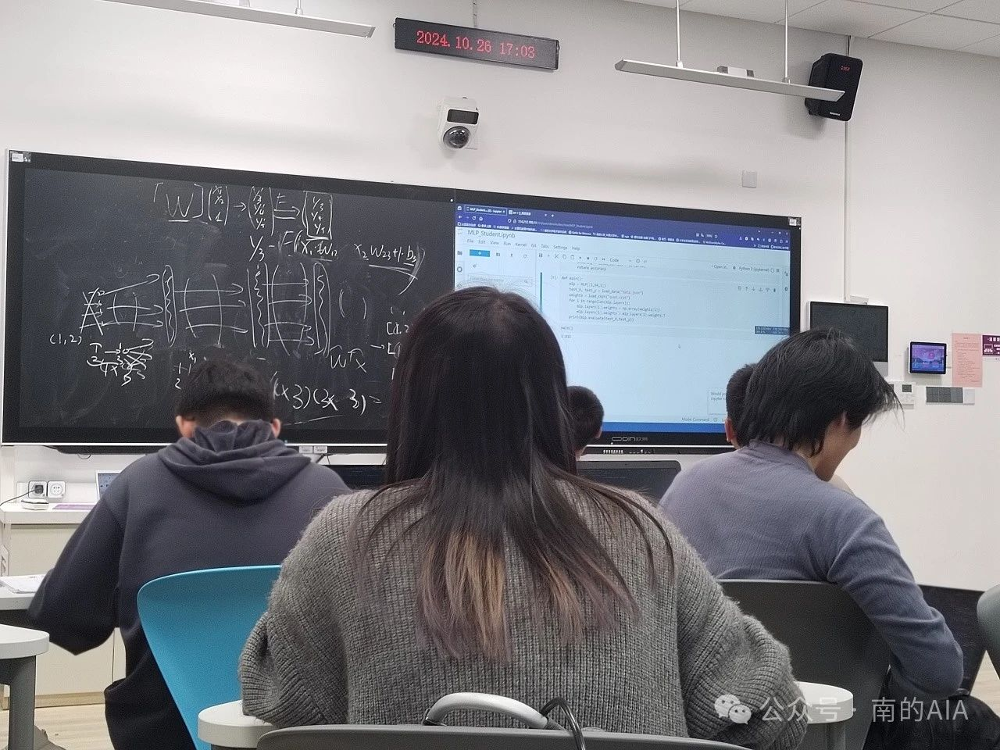
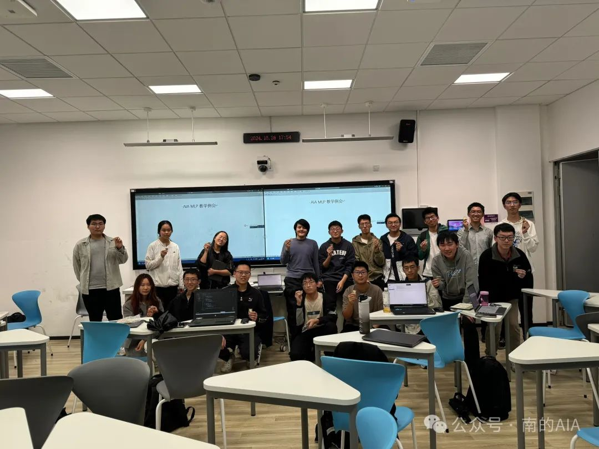

#### 例会议程
1. 数学推导部分[目标建模->数学推导->目标结构/公式]

2. 代码想法部分[目标结构/公式&numpy向量矩阵函数介绍->实现思路]

3. 手搓演示部分[实现思路&python jupyter->完整手搓模型]

4. 你的实现部分[你将自己从零手搓一个MLP网络模型--别担心，刚刚讲过一遍之外我们还有助教团答疑帮你:)]

#### 所需背景知识
•高中多项式加减，函数知识
•简单的python代码能看懂(不会的话可以看看自学指南中的简单方法学python，看3篇就能懂了；也可以看runoob菜鸟教程)
•（可选）矩阵与向量乘法
•（可选）用过numpy库

#### 您可能会收获
1掌握MLP数学的实现原理及其推导过程（为什么这么构造）
2掌握MLP的实现方法，以及能从提供矩阵向量运算的库的基础上从零手搓MLP网络。
3神秘礼品




### 引入

本次教学例会的主讲人是岳逸帆。他提到：今年的诺贝尔奖颁给了人工智能领域的 Hinton ，其主要研究成果聚焦于 ANN（人工神经网络，Artificial Neural Network），即MLP（多层感知机，Multilayer Perceptron）。今天我们可以通过简单的讲解自己“手搓”一个 MLP 。 MLP 虽看似复杂，本质却只是一种数学方法。我们通过数学和编程工具，可以更好地理解并构建 MLP。 人工神经网络，听上去就像计算机也有生物体的神经网络一样。事实上，我们可以将人工神经网络比作生物神经网络——它们都是通过“神经元”传递和处理信息的系统。然而，ANN 的工作机制本质上是以数学为基础的，通过激活函数，神经元才能有条件地输出大量信号，而激活函数本身是一种数学操作，这在生物的神经网络有着本质的区别。


### 数学解析：激活函数、神经元与隐藏层

#### 激活函数的类型

激活函数的类型在本次例会中，我们介绍了以下几种基本的激活函数，包括阶跃函数；

Sigmoid函数：$S(x)= \frac{1}{1+e^{-x}}$

```
def sigmoid(x):    
    return 1/(1+np.exp(-x))
```

ReLU函数（Rectified Linear Unit）：$f(x)=max(x,0)$

```
def relu(x):    
    return np.maximum(x,0)
```

这些函数将输入值转化为特定范围的输出，使得网络能够进行更复杂的非线性映射。

#### 神经元的工作机制

MLP中每个神经元的输出公式为 $f(\sum{w_ix_i}+b) $，其中 $w_i$ 代表权重， $x_i$ 是输入， $b$ 是偏置，$f$ 是激活函数。尽管公式看似复杂，但通过绘制示意图，便能清晰地理解加和符号 $\sum{}$ 、权重 $w$ 和偏置 $b$ 的含义。激活函数 $f$ 的存在，赋予了模型进行复杂映射的能力；若缺少，则无论叠加多少层，模型的表达能力都有限，甚至无法正确地解决简单的 XOR 问题。

#### 隐藏层的必要性

我们通过与或非门和异或门的实例讨论了隐藏层的作用，进一步讲解了线性可分与非线性可分的概念。隐藏层使得神经网络能够近似任意函数，这就是“万有逼近定理”所揭示的内容。深度和宽度的不同组合可以影响网络的表现，使得网络具备更高的表达能力。


###  使用NumPy实现基础运算

为了让大家掌握MLP的实现，我们还进行了半个小时的NumPy教学，涵盖了向量和矩阵的创建与操作。

#### 创建向量/矩阵及其形状

在 Python 中使用 NumPy 创建数组非常便捷，例如 array、zeros、linspace 等操作能轻松生成不同形状的向量和矩阵。同时，通过 shape 属性，我们可以查看数组的维度，便于后续的数学运算。

#### 矩阵的运算

矩阵乘法、点乘、逆矩阵、伪逆矩阵以及特征值等操作是构建 MLP 的基础。我们在代码实践中，通过 @ 符号实现矩阵乘法，用 * 实现点乘。通过这部分的学习，大家具备了使用 NumPy 实现基本 MLP 运算的能力。

### 代码实战

随后的一个小时，同学们在助教的悉心帮助下，全身心投入到手搓代码的任务当中。助教们穿梭于同学们之间，针对大家在编写代码过程中遇到的各类问题，如语法错误、逻辑不清、算法实现疑惑等，及时给予耐心细致的解答与指导。同学们则依据之前所学的数学知识、numpy 相关操作等内容，一步一个脚印地将代码从无到有地“搓”出来，通过不断调试与完善，逐步实现了与 MLP 相关的各项功能代码的编写，切实将理论知识转化为实际的代码成果，进一步加深了对 MLP 的理解与掌握。

本次活动从理论到实践，层层递进，使得大家对多层感知机（MLP）有了一个全方位的理解。这不仅加深了大家对人工神经网络的认识，还培养了实际编程能力。



>配图：冯奕康
美编：冯奕康 

> 文编|李炎培 岳逸帆  
美编|张馨月


[阅读原文](https://mp.weixin.qq.com/s/O8_7OchrD2uljW3vhhrqgQ)

[示例代码](https://github.com/NJU-AIA/Learning/blob/main/MLP_Learning/lecture_code/MLP_Done.ipynb)

```python
import numpy as np # 只会用到这个
import json # 用来加载数据
# 一些辅助的函数

def sigmoid(x):
    return 1/(1+np.exp(-x))

def d_sigmoid(x):
    return sigmoid(x) * (1 - sigmoid(x))

def relu(x):
    return np.maximum(x,0)

def d_relu(x):
    return np.array([0 if i <= 0 else 1 for i in x])

def load_data(path):
    with open(path, 'r') as f:
        json_data = json.load(f)
        X = np.array(json_data['x'])
        X = (X - np.mean(X,axis=0)) / np.std(X, axis=0)
        y = np.array(json_data['y'])
        return X,y 

class Layer:
    def __init__(self, input_dim, output_dim, function):
        self.input_dim = input_dim
        self.output_dim = output_dim
        self.function = function
        if function == sigmoid:
            self.derevative = d_sigmoid
        if function == relu:
            self.derevative = d_relu
        self.weights = np.random.randn(input_dim+1, output_dim)
    def forward(self, x):
        x = np.array([np.append(data, 1) for data in x])
        return self.function(x @ self.weights)
    # def backward(self, delta): We'll do it next time
        
class MLP:
    def __init__(self, shapes):
        self.layers = [
            Layer(shapes[i], shapes[i+1], sigmoid)
            for i in range(len(shapes) - 1)
        ]
    def forward(self, x):
        for layer in self.layers:
            x = layer.forward(x)
        return x
    
    # def backward(self, y): We will do this next time!
    # def train(self, train_set, loss='mse', epochs=100, lr=0.3): We will do this next time!
    
    def load_ckpt(self, ckpt_file_name):
        with open(ckpt_file_name, 'r') as f:
            json_data = json.load(f)
            weights = json_data['weights']
            for index, layer in enumerate(self.layers):
                layer.weights = np.array(weights[index])
                layer.weights = layer.weights.T
            

    def save_ckpt(self, ckpt_file_name):
        with open(ckpt_file_name, 'w') as f:
            data = {
                'weights': [layer.weights for layer in self.layers]       
            }
            json_data = json.dumps(data)
            f.write(json_data)
            
    def evaluate(self, X, y):
        pred = self.forward(X)
        accuracy = 0
        for i, predi in enumerate(pred):
            predi = predi[0] # 因为我们的模型输出是1维的
            if np.abs(predi - y[i]) < 0.5:
                accuracy += 1
        accuracy = accuracy / len(pred)
        return accuracy

def main():
    test_X, test_y = load_data("data.json")
    n, dim = test_X.shape
    mlp = MLP([dim,64,1])
    mlp.load_ckpt("quad.ckpt")
    print(mlp.evaluate(test_X, test_y))

main()
```