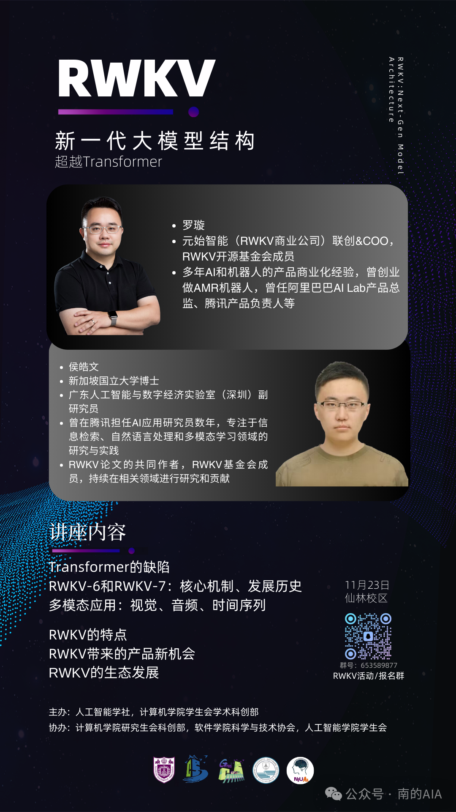

本月23日，我们举办一场深入解析RWKV模型的AI技术讲座，作为结合RNN与Transformer优势的新型架构，RWKV在性能和内存效率上实现了重大突破，并已在全球广泛部署。
我们有幸邀请到元始智能（RWKV商业公司）联合创始人兼COO，RWKV开源基金会成员罗璇老师，以及RWKV论文共同创作者侯皓文老师，简明讲解RWKV的技术优势与未来应用场景。

在讲座中，您将了解： 
✨ RWKV是什么：它是如何发展而来的？  
🔍 RWKV的核心机制：为何它在多个领域中表现优异？  
🎯 RWKV的特点与未来：它将在未来创造哪些新的机会？无论您是AI研究者还是技术爱好者，都欢迎报名参与！
📅 时间：2024年11月23日
📍 地点：南京大学仙林校区，具体地点将在报名人数确定后通过活动群通知
🔍 活动群号：653589877

