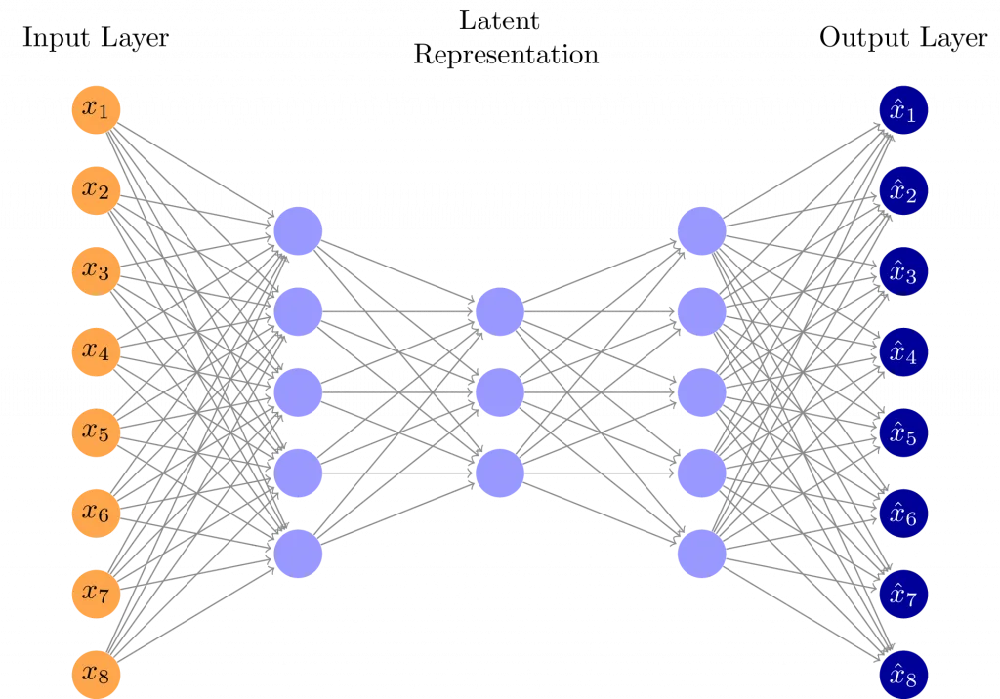

import  PaperBlock  from '../../components/PaperBlock.astro';


# BERT：结构化排版测试

> 本文用于测试 MDX 格式下的学术论文排版支持能力，包括 markdown 渲染、KaTeX 数学、列表、代码等。

---

## 一、引言

<PaperBlock id="intro" translation="BERT 是基于 Transformer 的预训练语言模型。" note="模型结构概览">
  BERT (**Bidirectional Encoder Representations from Transformers**) 是一种 *深度双向* Transformer 模型，在多个 NLP 任务中表现出色。
</PaperBlock>

---

## 二、训练目标

<PaperBlock id="objectives" translation="BERT 的两个训练目标分别为 Masked LM 与 NSP。" note="任务定义">
  BERT 同时优化两个目标：

  1. **Masked Language Model (MLM)**
  2. **Next Sentence Prediction (NSP)**
</PaperBlock>

---

## 三、数学公式支持

### 行内公式

<PaperBlock id="inline-math" translation="损失函数为单词预测的对数似然。" note="注意 \\log 与 \\sum 的转义">
  损失函数为：$L = -\sum_{i} \log P(w_i \mid \text{context})$
</PaperBlock>

### 块级公式

<PaperBlock id="block-math" translation="完整的预训练目标。" note="显示为独立区块">
  $$
  L = L_{MLM} + L_{NSP}
  $$
</PaperBlock>

---

## 四、代码与表格测试

### 代码块

<PaperBlock id="code" translation="Python 示例代码。" note="语法高亮测试">
  ```python
  import torch
  from transformers import BertModel

  model = BertModel.from_pretrained("bert-base-uncased")
  outputs = model(input_ids)
  print(outputs.last_hidden_state.shape)
  ```
</PaperBlock>

<PaperBlock id="image" translation="模型结构图。" note="图像居中展示">  </PaperBlock>

<PaperBlock
  id="intro"
  translation="BERT 是一个双向 Transformer 编码器结构的预训练语言模型。"
  note="这是对 NLP 领域的重大突破。"
  collapsible={true}
  layout="side-by-side"
>
  BERT (**Bidirectional Encoder Representations from Transformers**) 是一种 *深度双向* Transformer 模型。
</PaperBlock>