# 神经网络基础

AIA 人工智能学社 · 例会

---

# 目录

<Toc minDepth="1" maxDepth="2" />

---

# 引入

## 什么是 AI

- 人工智能：让机器具有人类的智慧

---

## AI 与机器学习

- 人工智能：让机器具有人类的智慧  
- 机器学习：让机器从数据中学习到规律

  
  

> 猫 / 狗

---

## AI 与机器学习（续）

- 人工智能：让机器具有人类的智慧  
- 机器学习：让机器从数据中学习到规律

  
  

> 猫 / 狗

---

## 神经网络与深度学习

- 人工智能：让机器具有人类的智慧  
- 机器学习：让机器从数据中学习到规律  
- 神经网络：实现机器学习的具体结构

  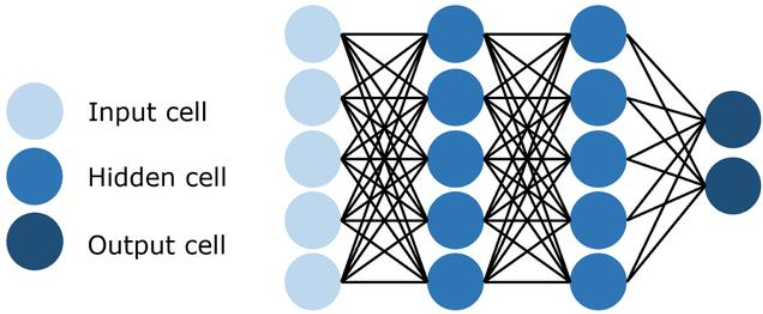

---

## 神经网络与深度学习（续）

- 神经网络层数较多 → **深度学习**

  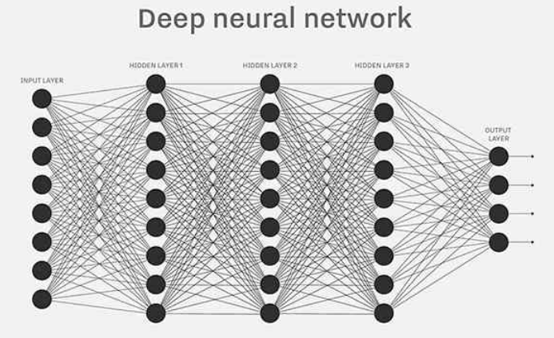

---

## 为什么要做手写数字识别

思考：人类是怎么识别手写数字的？

  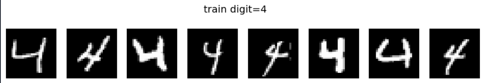

*这些都是 4*

  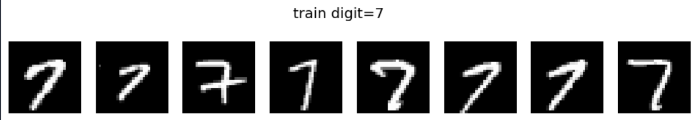

*这些都是 7*

---

我们想要的数据：**图片 + 标签**

---

我们想要的数据：**图片 + 标签**  
**MNIST** 数据集恰好符合我们的要求

  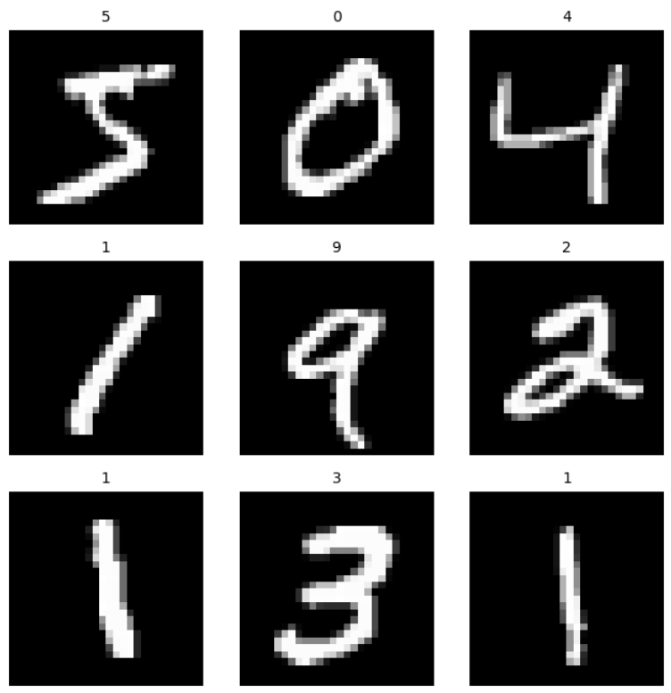

*MNIST 数据集的前 9 张图片*

---

实现机器学习的具体结构是神经网络，在我们的任务里，我们会使用一种非常简单的神经网络：**多层感知机（MLP）**。

  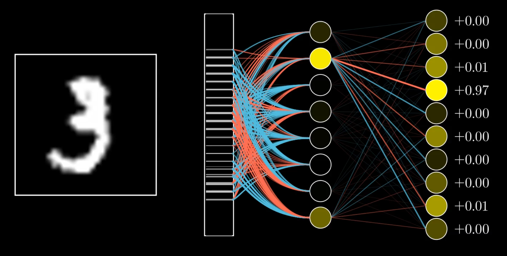

---

# MLP 的结构与前向传播

## 直觉上的类比理解

人是如何识别图像的？

  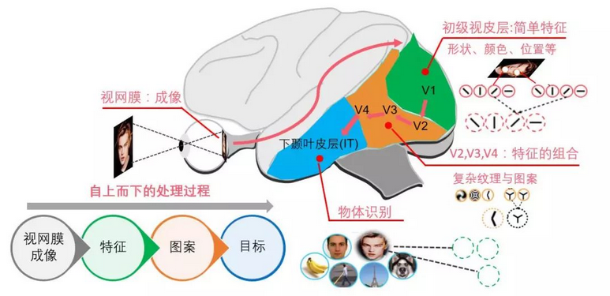

---

MNIST 中的图片：`28 × 28` 的灰度图  
灰度值：`0 ~ 255`，`0` 黑色，`255` 白色

  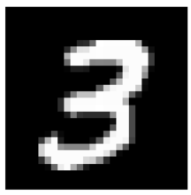

---

类比理解我们的网络：

  

---

## 神经元在做的事情：提取特征

**缩小版例子：**

$$
\begin{bmatrix}
x_1 & x_2 & x_3 & x_4 \\
x_5 & x_6 & x_7 & x_8 \\
x_9 & x_{10} & x_{11} & x_{12} \\
x_{13} & x_{14} & x_{15} & x_{16}
\end{bmatrix}
$$

神经元提取值：

$$
y = \sum_{i=1}^{16} w_i x_i
$$

---

若想判断中间小方块是否**足够亮**，可令权重只选择中心四个像素，其余为 0：  
$y = x_6 + x_7 + x_{10} + x_{11}$

  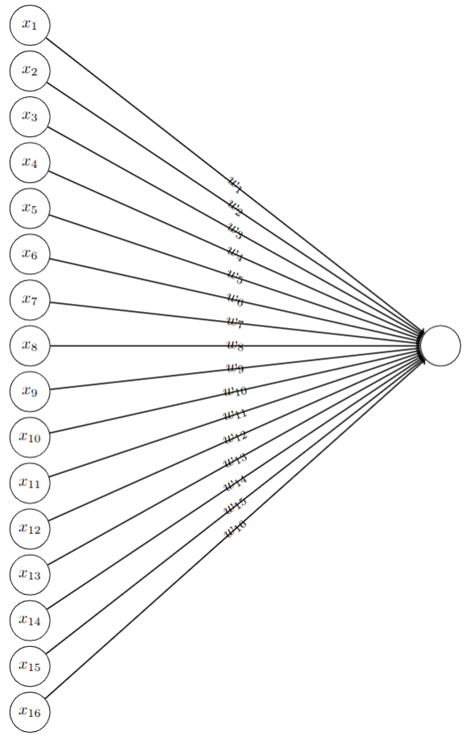

---

有时需要**阈值**：

$$
y = \sum_i w_i x_i - \text{threshold}
$$

令 $b = -\text{threshold}$：

$$
y = \sum_i w_i x_i + b
$$

---

::left::
我们的模型也是一个道理，只不过左边的矩阵更大（`28×28=784`）：

$$
y = \sum_{i=1}^{784} w_i x_i + b
$$

  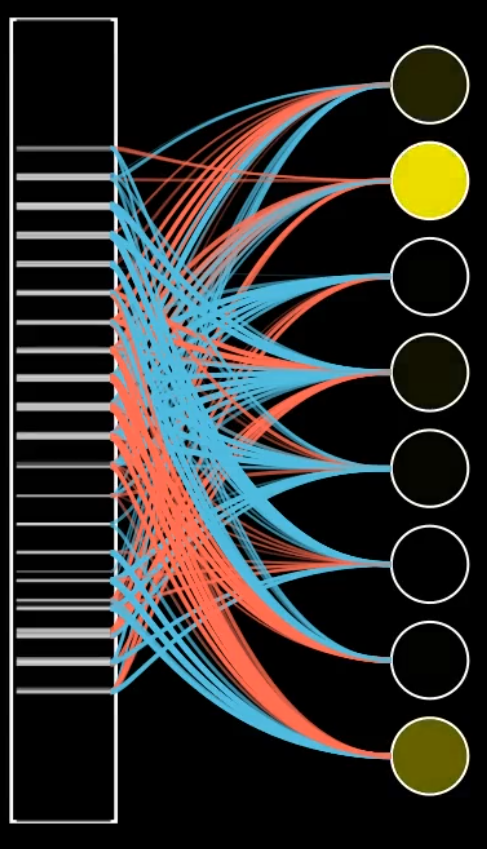

---

**有没有什么问题？**

- 线性 vs 非线性

  

---

  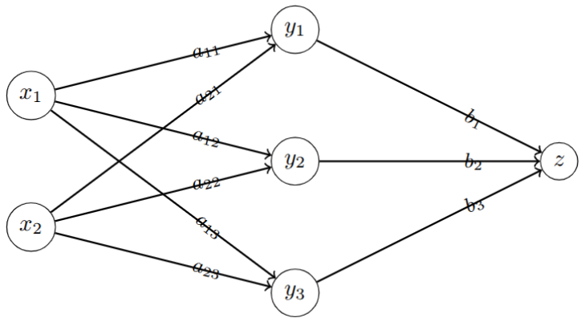

展开可见：**多层线性结构仍是线性**  
因此**需要非线性**来提升表达能力。

---

线性结构的表达能力有限：  
例如用直线实现异或（XOR）二分类是做不到的。

$$
x \oplus y =
\begin{cases}
1 & x \ne y \\
0 & \text{otherwise}
\end{cases}
$$

---

无法找到这样的直线！

  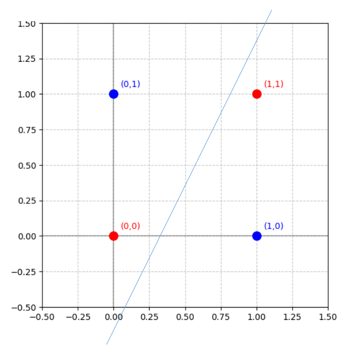

---

## 解决方案 1：用曲线（Sigmoid）

$$
\sigma(z) = \frac{1}{1 + e^{-z}}
$$

单个神经元输出：

$$
y = \sigma\!\left(\sum_i w_i x_i + b\right)
$$

  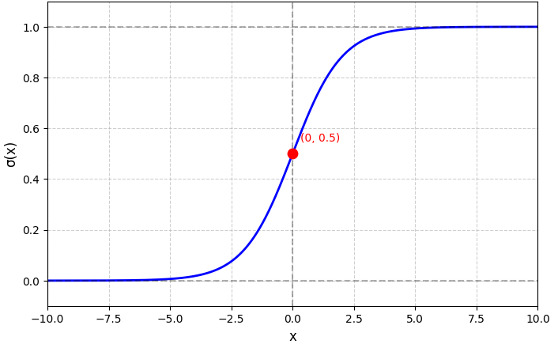
  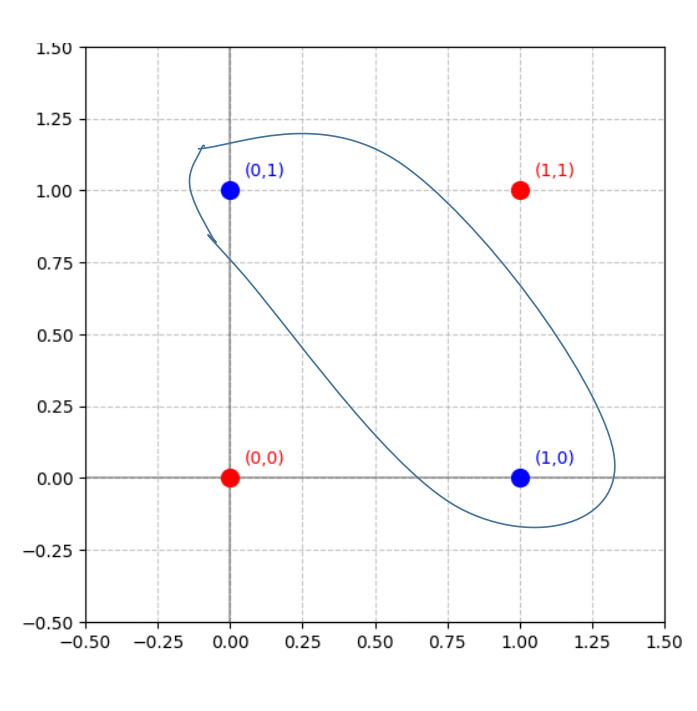

---

## 解决方案 2：用折线（ReLU）

$$
\text{ReLU}(z) = \max(0, z)
$$

单个神经元输出：

$$
y = \text{ReLU}\!\left(\sum_i w_i x_i + b\right)
$$

  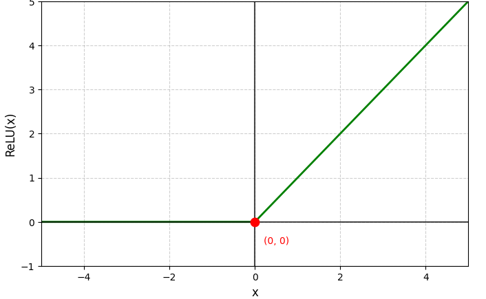
  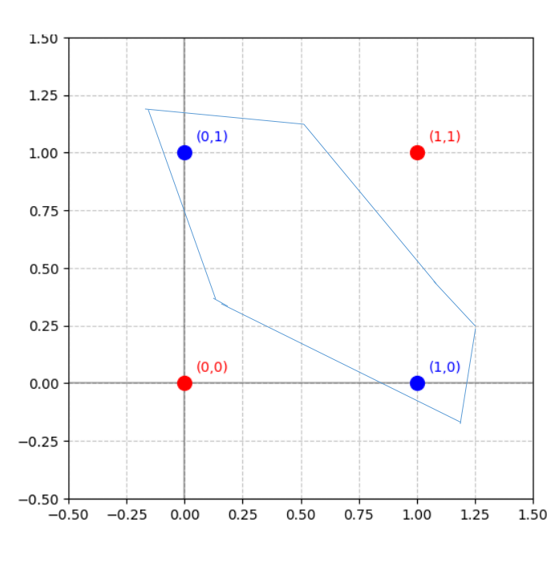

---

**激活函数**：为网络引入非线性

  
  

> 本次例会，我们使用 **sigmoid** 作为隐藏层激活函数。

---

  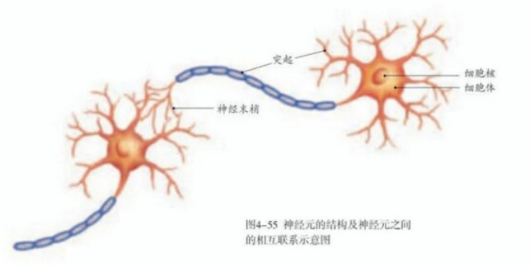
  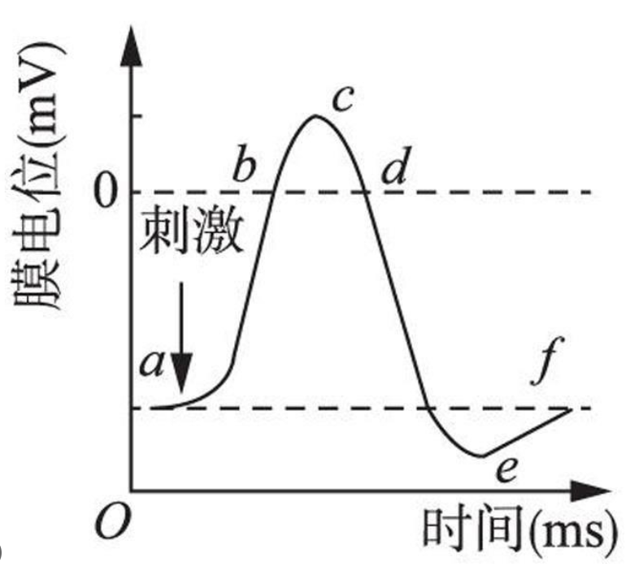

---

感知器（Perceptron）

- 接收若干个 0/1 输入  
- 输出：
$$
y =
\begin{cases}
0, & \sum_i w_i x_i + b \le 0 \\
1, & \text{otherwise}
\end{cases}
$$

  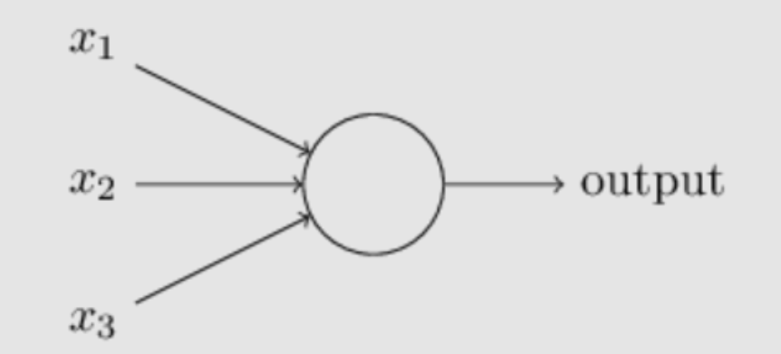
  

---

## 使用矩阵简化表达

我们的 MLP：输入层 784、隐藏层 8、输出层 10

输入 $\mathbf{x}=\{x_1,\dots,x_{784}\}$，权重矩阵 $\mathbf{W}$（784×8），偏置 $\mathbf{b}$（8）

$$
\mathbf{z}_1 = \mathbf{x}\mathbf{W}_1 + \mathbf{b}_1,\quad
\mathbf{y}_1 = \sigma(\mathbf{z}_1)
$$

矩阵乘法复习：

$$
\begin{bmatrix}
2 & 3 & 1 \\
3 & 5 & 2
\end{bmatrix}
\times
\begin{bmatrix}
5 & 2 \\
3 & 1 \\
2 & 4
\end{bmatrix}
=
\begin{bmatrix}
21 & 11 \\
34 & 19
\end{bmatrix}
$$

---

隐藏层到输出层：

$$
\mathbf{z}_2 = \mathbf{y}_1 \mathbf{W}_2 + \mathbf{b}_2,\quad
\mathbf{y}_2 = \text{softmax}(\mathbf{z}_2)
$$

  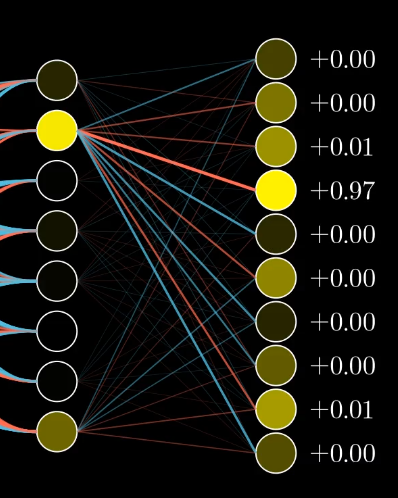

---

为什么用 softmax？

- 每一项在 $[0,1]$  
- 各项之和为 1

因此可自然解释为**概率分布**。

---

  

$$
\begin{aligned}
\mathbf{z}_1 &= \mathbf{x}\mathbf{W}_1 + \mathbf{b}_1 \\
\mathbf{y}_1 &= \sigma(\mathbf{z}_1) \\
\mathbf{z}_2 &= \mathbf{y}_1\mathbf{W}_2 + \mathbf{b}_2 \\
\mathbf{y}_2 &= \text{softmax}(\mathbf{z}_2)
\end{aligned}
$$

---

# 写写代码吧

1. 例会代码仓库：<https://github.com/NJU-AIA/MLP>（clone 到本地）  
2. 运行 `download.py` 下载 MNIST  
3. 完成 `mlp.py` 的 `forward` 函数  
4. 运行 `mlp.ipynb`

$$
\begin{aligned}
\mathbf{z}_1 &= \mathbf{x}\mathbf{W}_1 + \mathbf{b}_1\\
\mathbf{y}_1 &= \sigma(\mathbf{z}_1)\\
\mathbf{z}_2 &= \mathbf{y}_1\mathbf{W}_2 + \mathbf{b}_2\\
\mathbf{y}_2 &= \text{softmax}(\mathbf{z}_2)
\end{aligned}
$$

---

# 训练我们的模型

## 训练流程

机器学习：**拟合一个映射**

  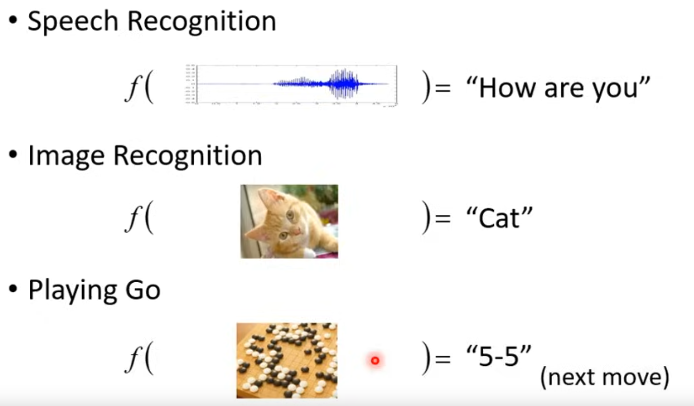

训练：将初始网络 → 可用网络
- 衡量模型参数的好坏  
- 根据指标调整模型参数

---

## 衡量模型参数的好坏

输出概率分布：$\mathbf{y}_2=\{y_{2,0},\dots,y_{2,9}\}$

  

---

真实答案（one-hot），如数字 3：  
$\mathbf{y}=\{0,0,0,1,0,0,0,0,0,0\}$

两类常见损失：
- **均方误差** $L=(\mathbf{y}_2-\mathbf{y})^2$
- **交叉熵** $L=-\ln(y_{2,3})$

> 损失函数衡量“好坏”，记作 $L$

---

| 视角 | 神经网络 | 损失函数 |
|---|---|---|
| 输入 | 输入数据 | 模型参数 |
| 参数 | 模型参数 | 输入数据 |
| 输出 | 输出结果 | 衡量指标 |

一个好的损失函数：当其值减小时，模型在训练集上的表现更好。

训练目标：**最小化损失函数**。

---

## 调整模型参数：梯度下降

目标：$\min L$

两种思路：
- 直接求解析最优（通常不可行）
- 迭代：每次让 $\Delta L < 0$

把损失函数看作多元函数：  
$Loss=L(x_1,\dots,x_n)$

---

一元函数 $y=f(x)$，当 $\Delta x\to0$：

$$
\Delta y \approx f'(x)\,\Delta x
$$

导数是小变化下的**比例系数**。

  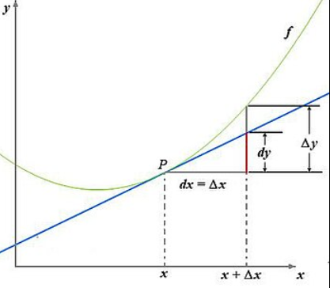

---

多元情形：

$$
\Delta L \approx \sum_{i=1}^n \frac{\partial L}{\partial x_i}\,\Delta x_i
$$

令 $\Delta x_i = -\eta \frac{\partial L}{\partial x_i}$, $\eta>0$

$$
\Delta L = -\eta \sum_{i=1}^n \left(\frac{\partial L}{\partial x_i}\right)^2 \le 0
$$

---

向量形式：

$$
\vec{\nabla L}=\left\{\frac{\partial L}{\partial x_1},\dots,\frac{\partial L}{\partial x_n}\right\},\quad
\vec{\Delta x}=\{\Delta x_1,\dots,\Delta x_n\}
$$

$$
\Delta L = \vec{\nabla L}\cdot \vec{\Delta x}
$$

**固定步长时**，沿**梯度反方向**下降最快 → **梯度下降**。

---

学习率 $\eta$：

$$
\vec{\Delta x} = -\eta\,\vec{\nabla L}
$$

梯度下降：每步用当前梯度的**反方向**更新参数，使损失下降。

  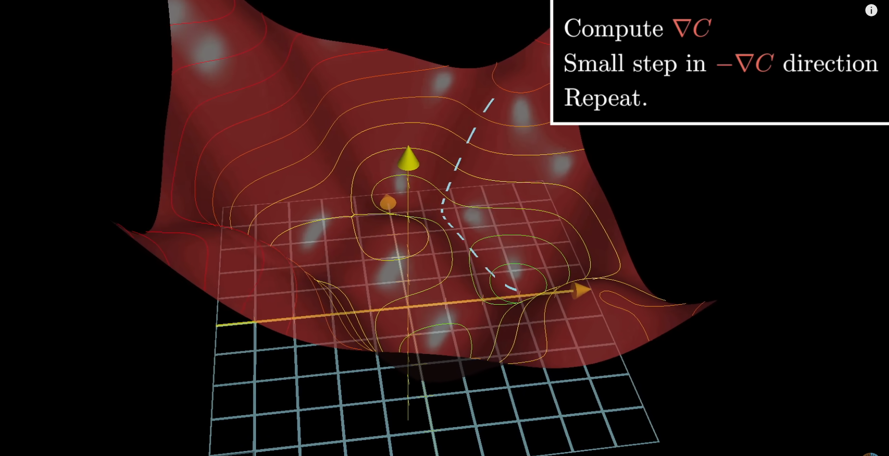

---

把变化量还原到矩阵形状（示例 $\mathbf{W}_1$）：

$$
\Delta \mathbf{W}_1 = -\eta\,\frac{\partial L}{\partial \mathbf{W}_1}
$$

其他同理：

$$
\Delta \mathbf{b}_1=-\eta\frac{\partial L}{\partial \mathbf{b}_1},\quad
\Delta \mathbf{W}_2=-\eta\frac{\partial L}{\partial \mathbf{W}_2},\quad
\Delta \mathbf{b}_2=-\eta\frac{\partial L}{\partial \mathbf{b}_2}
$$

---

# 写写代码吧（训练）

- 在 `mlp.py` 中实现 `step`（使用 `self.dW1/db1/dW2/db2`）
- 运行 `mlp.py` 看训练效果

$$
\begin{aligned}
\Delta \mathbf{W}_1 &=-\eta \frac{\partial L}{\partial \mathbf{W}_1}\\
\Delta \mathbf{b}_1 &=-\eta \frac{\partial L}{\partial \mathbf{b}_1}\\
\Delta \mathbf{W}_2 &=-\eta \frac{\partial L}{\partial \mathbf{W}_2}\\
\Delta \mathbf{b}_2 &=-\eta \frac{\partial L}{\partial \mathbf{b}_2}
\end{aligned}
$$

  

---

# 总结

- 基本概念  
- MLP 的结构与前向传播  
- 如何训练一个模型

今天学习的简单模型，也是大模型的重要组成部分：

  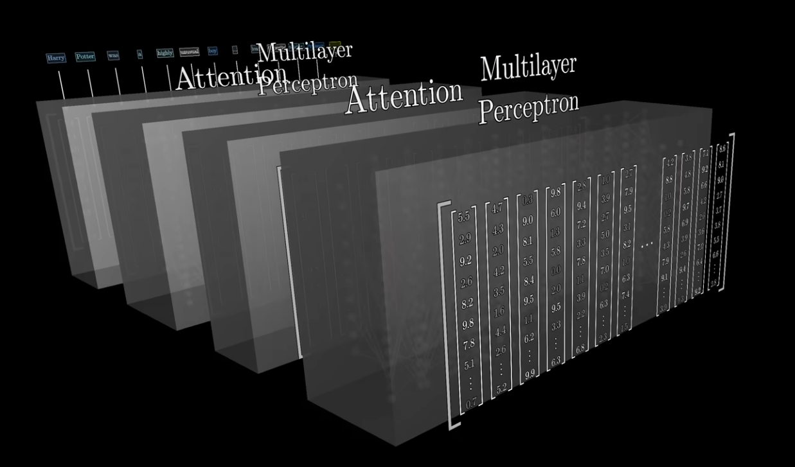

*Transformer*

---

神经网络究竟学习到了什么？笔画？结构？

把输入层到隐藏层的权重按像素重排，观察网络在提取什么：

  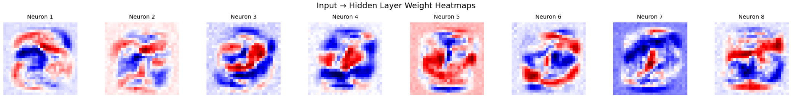

---

深度学习的**不可解释性**：
- 模型应该学到了一些规律；
- 但我们往往很难**完全解释**这些规律。

  

---

# 谢谢大家！
